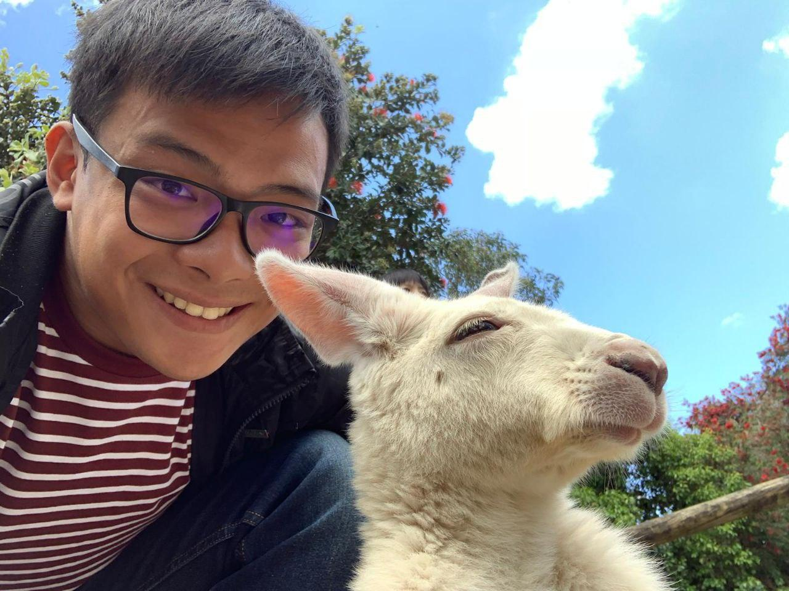
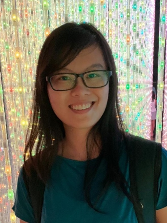
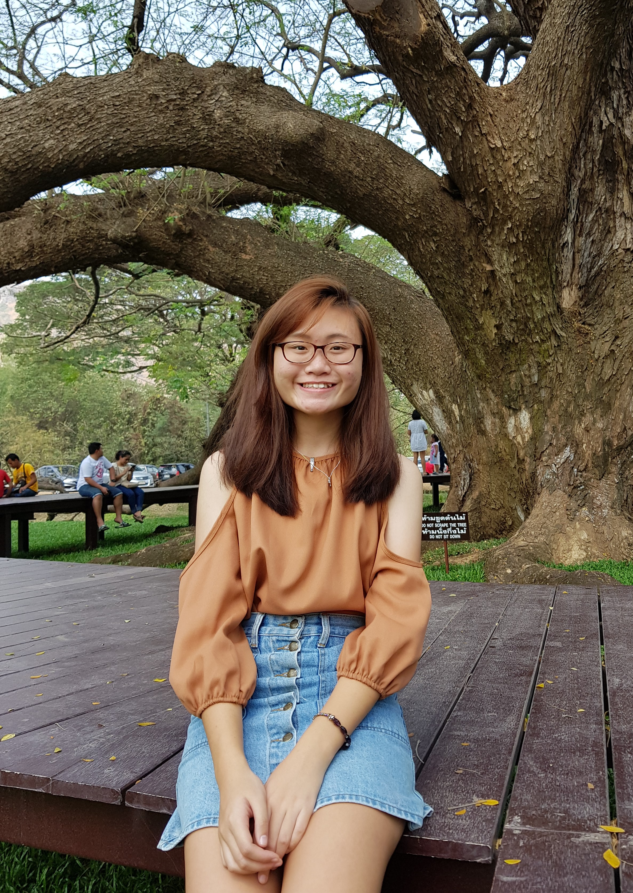
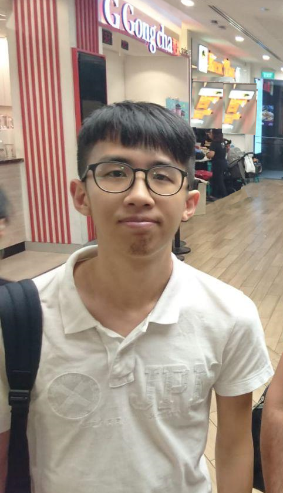
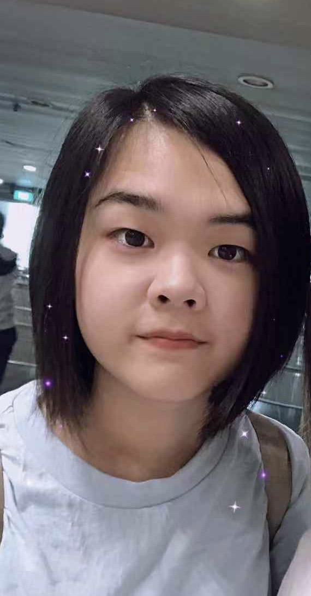

We are a team based in the [School of Computing, National University of Singapore](http://www.comp.nus.edu.sg).

You can reach us at the following emails:
- Cheak Han Wei - `e0389075@u.nus.edu`
- Chia Wen Ling - `e0425906@u.nus.edu`
- Koh Rui Ling - `e0426268@u.nus.edu`
- Lim Ethan - `e0406537@u.nus.edu`
- Lin Yingqi - `e0424735@u.nus.edu`

## Project team

### Cheak Han Wei

[[github](https://github.com/hanweic53)]
[[portfolio](team/hanweic53.md)]

* Role: Developer
* Responsibilities: Deliverables and deadlines + Integration

### Chia Wen Ling

[[github](http://github.com/cwenling)]
[[portfolio](team/cwenling.md)]

* Role: Developer
* Responsibilities: Code Quality + Integration

### Koh Rui Ling

[[github](http://github.com/ruilingk)]
[[portfolio](team/ruilingk.md)]

* Role: Team Lead
* Responsibilities: Testing

### Lim Ethan

[[github](http://github.com/ethan-l-m-e)]
[[portfolio](team/ethan-l-m-e.md)]

* Role: Developer
* Responsibilities: Code Quality + Schedule & Tracking

### Lin Yingqi

[[github](http://github.com/yingqi0607)]
[[portfolio](team/yingqi0607.md)]

* Role: Developer
* Responsibilities: Documentation + Testing
