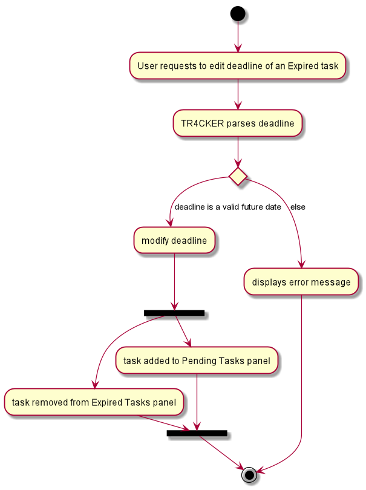

* Table of Contents
{:toc}

--------------------------------------------------------------------------------------------------------------------

## **Setting up, getting started**

Refer to the guide [_Setting up and getting started_](SettingUp.md).

--------------------------------------------------------------------------------------------------------------------

## **Design**

### Architecture

The ***Architecture Diagram*** given above explains the high-level design of TR4CKER. Given below is a quick overview
of each component.

:bulb: **Tip:** The `.puml` files used to create diagrams in this document can be found in the
[diagrams](https://github.com/AY2021S1-CS2103T-T10-2/tp/tree/master/docs/diagrams/) folder. Refer to the
[_PlantUML Tutorial_ at se-edu/guides](https://se-education.org/guides/tutorials/plantUml.html) to learn how to create
and edit diagrams.

**`Main`** has two classes called [`Main`](https://github.com/AY2021S1-CS2103T-T10-2/tp/tree/master/src/main/java/seedu/tr4cker/Main.java)
and [`MainApp`](https://github.com/AY2021S1-CS2103T-T10-2/tp/tree/master/src/main/java/seedu/tr4cker/MainApp.java).
It is responsible for,
* At TR4CKER launch: Initializes the components in the correct sequence, and connects them up with each other.
* At shut down: Shuts down the components and invokes cleanup methods where necessary.

[**`Commons`**](#common-classes) represents a collection of classes used by multiple other components.

The rest of TR4CKER consists of four components.

* [**`UI`**](#ui-component): The UI of TR4CKER.
* [**`Logic`**](#logic-component): The command executor.
* [**`Model`**](#model-component): Holds the data of TR4CKER in memory.
* [**`Storage`**](#storage-component): Reads data from, and writes data to, the hard disk.

Each of the four components,

* defines its *API* in an `interface` with the same name as the Component.
* exposes its functionality using a concrete `{Component Name}Manager` class (which implements the corresponding API
`interface` mentioned in the previous point.

For example, the `Logic` component (see the class diagram given below) defines its API in the `Logic.java` interface and
exposes its functionality using the `LogicManager.java` class which implements the `Logic` interface.

**How the architecture components interact with each other**

The *Sequence Diagram* below shows how the components interact with each other for the scenario where the user issues
the command `delete 1`.

The sections below give more details of each component.

### UI component

**API** :
[`Ui.java`](https://github.com/AY2021S1-CS2103T-T10-2/tp/tree/master/src/main/java/seedu/tr4cker/ui/Ui.java)

The UI consists of a `MainWindow` that is made up of parts e.g.`CommandBox`, `ResultDisplay`, `TaskListPanel`,
`StatusBarFooter` etc. All these, including the `MainWindow`, inherit from the abstract `UiPart` class.

The `UI` component uses JavaFx UI framework. The layout of these UI parts are defined in matching `.fxml` files that are
in the `src/main/resources/view` folder. For example, the layout of the [`MainWindow`](https://github.com/AY2021S1-CS2103T-T10-2/tp/tree/master/src/main/java/seedu/tr4cker/ui/MainWindow.java)
is specified in [`MainWindow.fxml`](https://github.com/AY2021S1-CS2103T-T10-2/tp/tree/master/src/main/resources/view/MainWindow.fxml)

The `UI` component,

* Executes user commands using the `Logic` component.
* Listens for changes to `Model` data so that the UI can be updated with the modified data.

### Logic component

**API** :
[`Logic.java`](https://github.com/AY2021S1-CS2103T-T10-2/tp/tree/master/src/main/java/seedu/tr4cker/logic/Logic.java)

1. `Logic` uses the `Tr4ckerParser` class to parse the user command.
1. This results in a `Command` object which is executed by the `LogicManager`.
1. The command execution can affect the `Model` (e.g. adding a person).
1. The result of the command execution is encapsulated as a `CommandResult` object which is passed back to the `Ui`.
1. In addition, the `CommandResult` object can also instruct the `Ui` to perform certain actions, such as displaying help to the user.

Given below is the Sequence Diagram for interactions within the `Logic` component for the `execute("delete 1")` API call.

:information_source: **Note:** The lifeline for `DeleteCommandParser` should
end at the destroy marker (X) but due to a limitation of PlantUML, the lifeline reaches the end of diagram.

### Model component

**API** : [`Model.java`](https://github.com/AY2021S1-CS2103T-T10-2/tp/tree/master/src/main/java/seedu/tr4cker/model/Model.java)

The `Model`,

* stores a `UserPref` object that represents the user’s preferences.
* stores the TR4CKER data.
* exposes an unmodifiable `ObservableList<Task>` that can be 'observed' e.g. the UI can be bound to this list so that
the UI automatically updates when the data in the list change.
* does not depend on any of the other three components.

:information_source: **Note:** An alternative (arguably, a more OOP) model
is given below. It has a `Tag` list in the `Tr4cker`, which `Task` references. This allows `Tr4cker` to only require one
`Tag` object per unique `Tag`, instead of each `Task` needing their own `Tag` object. 

### Storage component

**API** : [`Storage.java`](https://github.com/AY2021S1-CS2103T-T10-2/tp/tree/master/src/main/java/seedu/tr4cker/storage/Storage.java)

The `Storage` component:
* can save `UserPref` objects in json format and read it back
* can save TR4CKER data in json format and read it back

### Common classes

Classes used by multiple components are in the `seedu.tr4cker.commons` package.

--------------------------------------------------------------------------------------------------------------------

## **Implementation**

This section describes some noteworthy details on how certain features are implemented.

### Categorised Tasks Handling feature in Home tab \[coming in v1.3] (Han Wei)

### Feature introduction
This feature allows users to view and handle tasks under 3 categories separately.

### Implementation details
This feature comes in the form of a Task List panel, which is made up of three sub-panels:
1. Pending tasks (Incomplete tasks that are not overdue)
2. Expired tasks (Incomplete tasks that are overdue)
3. Completed tasks (Archived tasks)

Upon starting TR4CKER or refreshing of task lists, tasks which deadlines have passed will automatically appear under Expired tasks panel.
Users can modify tasks displayed in the Expired task panel using the Edit command.

The following diagram shows the sequence flow of a EditCommand which modifies the deadline of a task in the Expired task list:

Figure 1: Edit deadline of expired task Activity Diagram

Once the user marks a task as complete, it will automatically appear under Completed tasks.

### Design considerations:

#### Aspect 1: How users can easily view and control all the tasks
This design filters the tasks into 3 lists according to their completion statuses and deadlines which will be useful to the users,
as opposed to having browse through a long task list.

### Daily feature \[coming in v1.3] (Yingqi)
Tracker has a daily feature that allows users to add current tasks to a todo list for the day.
This feature allows users to plan for what they want to do for a particular day.

The 3 main functions of the Daily feature are to:
1. Add tasks from existing task list to a todo list
2. Display all tasks that the user wants to do for the day
3. The daily todo list is cleared everyday

#### Implementation
The UI of the Daily feature is facilitated by the `DailyPanel` class which will show users all daily todo tasks as a list.

To implement the commands of this Daily feature, there are `TodoCommand` and `TodoCommandParser` classes in the `logic` package.

The following diagram shows the sequence flow when a task gets added into the `DailyPanel`:

#### Design Considerations

##### Aspect 1: How users can plan for the things he/she wants to complete for the day

* **Current Choice:** When users use list command to view all tasks, only task names are shown.
  * Pros: A neater list is being shown.
  * Pros: Users can look through the list quickly and decide what to add to daily todo list.
  * Cons: Important details such and deadline and descriptions are omitted, users may not know which task is more urgent to do.

* **Alternative 1:** When users decides to add a particular task to daily todo list, details of that task is shown.
  * Pros: Users have clearer idea of the details of the tasks that he/she wants to complete for the day.
  * Cons: Details are shown only when the tasks is already added, if the user do not want to do it for the day, he/she has to delete it from todo list.

**Justification for current choice:** Users would already have details of the tasks in mind and therefore they will tend
to add the tasks they feel that are more urgent to daily todo list. Hence details can be ommited when users select tasks
to add into daily todo list.

### Module feature \[coming in v1.3] (Ethan)
TR4CKER has a module tab which provides users with an alternate view of tasks. Tasks are arranged in shorter lists categorized by modules.
This feature is to allow users to have a more focused overview of tasks, and know how many tasks are
pending for each module as opposed to the most-urgent-task-first organization in  main task list.

The 2 main functions of the Module feature are to:
1. Display all modules taken by the user.
2. Display the list of yet to be completed tasks under each module.

#### Implementation
To implement the UI of this Module feature, there will be a `ModuleTaskCard` & `ModuleTaskListPanel` classes
in the `ui` package, modified from the `TaskCard` and `TaskListPanel` classes. To implement the commands of
this module feature, there are `ModuleCommnad` and `ModuleCommandParser` classes in the `logic` package.

A module in the Modules tab has its own `ModuleTaskListPanel`, updated whenever new tasks are added with the module or are
edited to be associated under the module.

The following diagram shows the sequence flow when a task gets added to the `ModuleTaskListPanel` of a module:

Figure 1: Adding task to `ModuleTaskListPanel` of a module.

#### Design considerations:

##### Aspect 1: How modules are deleted and added to tasks

* **Current Choice:** Modules cannot be deleted if there are existing tasks tagged with the module. Tasks can only be
tagged with an existing module.
  * Pros: Safer, will not have stray tasks with non-existent modules.
  * Pros: User has safeguard against deleting modules that still has pending tasks.
  * Cons: Less flexible, extra steps for the user to create modules before assigning tasks, and delete tasks before
  deleting a module.

* **Alternative 1:** Allow both modules to be deleted and tasks to be tagged regardless of the others' existence.
  * Pros: More convenient for user to use without restrictions.
  * Cons: Prone to error, user may assign incorrectly with typos.

**Justification for current choice:** Better reliability of the feature by reducing possible errors by the user. As errors
will cause more time wasted for the user to fix them anyway, it seems that it is better to incur some overhead to
prevent making a mess altogether.

### Countdown feature (Wen Ling)
TR4CKER has a Countdown tab which allows users to add important events that they would like TR4CKER to countdown to.
This feature allows users to isolate the most important time sensitive events and deadlines, and tells the user exactly
how many days do they have to a certain event, which enhances the tracking experience.

These are the main functions of the Countdown feature:
1. Display a list of all events
2. Display the number of days left to an event and the date of an event
3. Add an event
4. Delete an event
5. Count the total number of events in a specified number of days from current date

#### Implementation
The UI of the Countdown feature is facilitated by the `countdown` package in `model` and `ui` packages. `CountdownCommand`
and `CountdownCommandParser` classes in the `logic` package implements this feature.
The class diagram (Figure 1) shown below summarises the implementation of the UI of the countdown feature:

Figure 1: Countdown Class Diagram

During the initialisation of TR4CKER, `CountdownTabWindow` will be initialised, together with `CountdownEventListPanel`.
`CountdownTabWindow` will execute `Logic#getfilteredEventList` to update the events list shown in Countdown tab.
The list of events will be sorted before it is displayed in the `CountdownEventListPanel`, and the events which has
passed will be placed at the end of the list, behind all the upcoming events.

When users execute countdown commands, mainly the commands to add or delete an event, the events in the
`CountdownEventListPanel` will be updated to reflect the new list of events, and the sorted order will be maintained.
This is done by initialising new `CountdownEventCard` objects to be placed in the `CountdownEventListPanel`, or by
removing those that are deleted.

The following sequence diagram (Figure 2) shows the execution of `countdown days/7`:

Figure 2: Countdown Sequence Diagram

When a user executes `CountdownCommand`, `countdown days/7` to count the number of events in the upcoming 7 days from
from today, `MainWindow` begins the execution of the command. `LogicManager` is then called to execute the
command. The command is then parsed in `Tr4ckerParser`, and `Tr4ckerParser` will create a new instance of
`CountdownCommandParser` to parse the user's input. After parsing and checking the validity of user's input, a
new `CountdownCommand` instance is created. This new instance `countdownCommand` will be passed back to `LogicManager`
to execute it on `Model` in the `CountdownCommand`. After executing, a new instance `CommandResult`, `commandResult` is
created. `commandResult` will be passed back to `MainWindow`, then it will be displayed in the results display box in
`CountdownTabWindow`.

Within the execution of `countdownCommand`, the list in `Model#getfilteredEventList`, to used to get a list of events
for `countdownCommand` to work on.

The following activity diagram summarises the flow of executing the various functions of `CountdownCommand`:

Figure 3: Countdown Activity Diagram

The activity diagram shows all the possible paths TR4CKER can take when a user executes a `CountdownCommand`, which is
identified by the use of the command word, `countdown`. After a command is entered, it's arguments are parsed, to know
which function the user wants to use:
1. Add an event
2. Delete an event
3. Count the number of events in a certain number of upcoming days
4. Switch to Countdown tab

The result of the command will be displayed accordingly, either in the events list box, or the result display box at
near the bottom of the GUI.

#### Design considerations:

##### Aspect 1: Viewing events in Countdowns

* **Current Choice:** Display all events in the `upcoming events` list in the Countdown tab, where users can add or
delete an event and have it be directly reflected in the list.
  * Pros: Users can see an overview of all events.
  * Pros: Users will be able to spot any mistakes in adding an event easily.
  * Cons: Less visually attractive as it is just a list.

* **Alternative 1:** Display only the earliest upcoming event prominently, and allow users to navigate to view
subsequent or previous events using `countdown next` and `countdown previous` commands.
  * Pros: More visually attractive, less cluttered, as users only see one event at a time.
  * Cons: May be difficult to navigate if there is a long list of events.
  * Cons: User will not know how many events they have in total.

**Justification for current choice:** We consider how users who are using the countdown feature will prefer to be able
to have a bird's eve view of all their events, and be able to gauge at a glance how many upcoming events they have.
(For example, how many exams they have and what is the range of dates that they fall on.) The first implementation
is also less prone to user errors as they can easily see whether the event is present in the list.

##### Aspect 2: Adding an event to Countdowns

* **Current Choice:** Add an event using the `countdown n/NAME d/DATE` command, to add directly to the list of events.
  * Pros: Command is short and sweet and is easy for users to remember.
  * Pros: Not reliant on the main TaskList in TR4CKER.
  * Cons: Users have to use a separate command if they want to track the same item as a task and as an event.

* **Alternative 1:** Allow users to add an event to events list, based on an existing task in task list, through a
command to convert a task to an event.
  * Pros: Users can type a shorter command if they want to add a task that is already in tasks list.
  * Cons: An event has lesser fields than a task, so using tasks to add an event is more complicated than necessary.

**Justification for current choice:** We recognise that an item in tasks lists is often very different from an item in
events list, (a user might add an exam or a festival to events list, whereas a task might be an assignment or a piece
of homework) so it would be better to have separate commands to reduce dependency between different types of things
that are being tracked, as well as to reduce confusion as to which tab to use.

### Planner feature (Rui Ling)
TR4CKER has a planner feature which provides users to view the calendar side-by-side with the tasks that are due on
specified day. This feature is to allow users to have a clearer view of their schedules and allow them to plan their
time ahead, and hence increasing productivity.

The 2 main functions of Planner command are to:
1. Switch to planner tab
2. Display an overview of tasks for today/tomorrow and on specified date/month

#### Implementation
To implement the UI of this planner feature, there is a `planner` package in `model` and `ui` packages. To implement
the commands of this planner feature, there are `PlannerCommand` and `PlannerCommandParser` classes in `logic` package.
The following class diagram (Figure 1) summarises how the UI aspect of this planner feature is being implemented:

Figure 1: Planner Class Diagram

During the initialisation of TR4CKER, `PlannerTabWindow` will be initialised, together with `PlannerCalendarPanel` and
`PlannerTaskListPanel`. `PlannerTabWindow` will execute `Logic#getPlannerFilteredTaskList` to update the tasks list shown in
Planner tab. The month and year of the calendar will be set in `PlannerCalendarPanel`. There are multiple `PlannerDayCard`
in 1 `PlannerCalendarPanel`. `PlannerDayCard` serves to store the details of each `PlannerDay`, which contains the date
of each grid in the `PlannerCalendarPanel`. When users execute planner commands, The month and year of the calendar will
be updated in `PlannerCalendarPanel`. Existing details of the calendar will also be cleared through
`PlannerCalendarPanel#clearCalendar()` and `PlannerDayCard#clear()`. At the same time, the tasks list will also be updated.

The following sequence diagram (Figure 2) shows how the planner feature works when a user executes `planner goto/today`:

Figure 2: Planner Sequence Diagram during execution of `planner goto/today`

When a user executes a `PlannerCommand` of `planner goto/today`, `MainWindow` will be called to execute the command. It will
then call `LogicManager` to execute, followed by parsing of command in `Tr4ckerParser`. `Tr4ckerParser` will create a new
instance of `PlannerCommandParser` to parse the user's input. After parsing and checking the validity of user's input, a
new `PlannerCommand` instance is created. This new instance `plannerCommand` will be passed back to `LogicManager` to execute
on the `Model` in `PlannerCommand`. After executing, a new instance `CommandResult` `commandResult` is created. `commandResult`
will be passed back to `MainWindow`, then it will be checked in `PlannerTabWindow` if the user wants to switch to Planner
tab, or to view a specific date/month. After that, the calendar and tasks list are updated in Planner tab, and user can
now see the results.

The following activity diagram (Figure 3) summarises what happens when a user executes the 2 main functions of
`PlannerCommand`:

Figure 3: Planner Activity Diagram

This activity diagram shows all the possible paths TR4CKER can take when a user executes a `PlannerCommand`. After
inputting a command, the command is parsed. By checking the arguments provided by the user, it can either mean the
user wants to:
1. switch to Planner tab
2. display an overview of tasks for today/tomorrow and on a specified date/month.

If user wants to switch to Planner tab, TR4CKER will display the planner, and a feedback will be provided to the user. If
user wants to display an overview of tasks, the validity of input will be checked. The input can take these 5 different paths:
1. today
2. tomorrow
3. specified date
4. specified month
5. error (not shown here).

Depending on the inputs, the calendar view and tasks list will be updated accordingly. Planner tab is then displayed to
the user and a feedback is provided.

#### Design considerations:

##### Aspect 1: How to represent tasks list for Planner tab

* **Current Choice:** Have a separate tasks list for Planner tab, which is the `PlannerTaskListPanel`class. This class
is different from the `TaskListPanel` class which is mainly used for the TR4CKER tab.
  * Pros: Obey Single Responsibility Principle whereby each class should only have one responsibility.
  * Pros: Developers using `PlannerTaskListPanel` class would not need to change the functionality of `TaskListPanel`
  class to suit what functionalities they want for the tasks list in Planner tab.
  * Cons: Additional coding and time would be required to create another class to cater to only tasks list in Planner tab.

* **Alternative 1:** Use the existing `TaskListPanel` class for the tasks list in Planner tab.
  * Pros: Do not need to code for another class and more time could have been spent on other features.
  * Cons: Do not obey Single Responsibility Principle as now a class would need to have 2 types of functionalities for
  different purposes.
  * Cons: Some functionalities for tasks list in TR4CKER tab and Planner tab differ, so accomodating for both functionalities
  in a single class is quite difficult.

**Justification for current choice:** After thinking about how having a separate class for the tasks list in Planner tab
would require more time and effort, I still choose to implement the current choice. This is because there are varying
functionalities to the tasks list in TR4CKER tab and Planner tab. For example, tasks list in TR4CKER tab only shows non-expired
tasks and shows every task on the list. However, tasks list in Planner tab shows any date that the user wants to go to
and can even show expired tasks if user chooses to go to a date in the past. Therefore, although it required more time
and effort, I think that having a separate class would be better since the tasks list in both tabs act differently.

##### Aspect 2: How users can easily navigate to today's/tomorrow's tasks list

* **Current Choice:** Use the same `planner` command to navigate to today's/tomorrow's tasks list. For example,
`planner goto/today` would navigate users to today's tasks list and `planner goto/tomorrow` would navigate users to
tomorrow's tasks list. Short forms are also provided such as `tdy` and `tmr`.
  * Pros: User-friendly as users would only need to know 1 command.
  * Pros: Users can use short forms, which increase convenience.
  * Cons: Users may not utilise this feature as they do not know the existence of it.

* **Alternative 1:** Separate commands to allow users to navigate to today's/tomorrow's tasks list.
  * Pros: Clearer error messages to prompt users that the input does not conform to standard.
  * Cons: Need to ensure that the implementation of each individual command is correct.
  * Cons: Not as user-friendly as users would need to know multiple commands now.

**Justification for current choice:** After thinking about how different commands would also have their own advantages,
I chose to implement the current choice. The current implementation would allow users to only know 1 command, which would
fairly be more user-friendly, especially after considering how TR4CKER also has many other commands available.
The problem of users not knowing the existence of this command could be solved by documenting this feature clearly in the
User Guide of TR4CKER.

--------------------------------------------------------------------------------------------------------------------

## **Documentation, logging, testing, configuration, dev-ops**

* [Documentation guide](Documentation.md)
* [Testing guide](Testing.md)
* [Logging guide](Logging.md)
* [Configuration guide](Configuration.md)
* [DevOps guide](DevOps.md)

--------------------------------------------------------------------------------------------------------------------

## **Appendix: Requirements**

### Product scope

**Target user profile**:

* busy SoC students
* has a need to manage a significant number of tasks, such as assignments
* prefer desktop applications over other types
* can type fast
* prefers typing to mouse interactions
* is reasonably comfortable using CLI applications

**Value proposition**: TR4CKER is a desktop application that helps SoC students track their tasks, meet their deadlines,
and stay productive. It is optimized for Computing students familiar with CLI, who can manage their tasks efficiently
by typing in commands.

### User stories

Priorities: High (must have) - `* * *`, Medium (nice to have) - `* *`, Low (unlikely to have) - `*`

| Priority | As a …​                                | I want to …​                                          | So that I can…​                                                     |
| -------- | ----------------------------------------- | -------------------------------------------------------- | ---------------------------------------------------------------------- |
| `* * *`  | student                                   | add a new task                                           |                                                                        |
| `* * *`  | student                                   | delete a task                                            | remove tasks that I have completed or no longer need                   |
| `* * *`  | student                                   | edit a task                                              | change the tasks that I have entered wrongly without deleting it       |
| `* * *`  | organised student                         | view all pending tasks                                   | have an overview of all tasks that I currently have                    |
| `* * *`  | forgetful student                         | view all expired tasks                                   | know which tasks I have not yet completed but are already expired      |
| `* * *`  | goal-oriented student                     | view all completed tasks                                 | know how productive I have been                                        |
| `* * *`  | student                                   | find a task                                              | find the tasks that match the keywords that I want to find             |
| `* * *`  | student                                   | mark a task as completed                                 | when I complete a task, I want to mark it as completed                 |
| `* * *`  | forgetful student                         | view my tasks in chronological order                     | know which tasks are due soon                                          |
| `* * *`  | user                                      | exit from TR4CKER                                        | indicate that I am done with what I wanted to do                       |
| `* * *`  | task-oriented student                     | add my tasks to daily to-dos                             | set a goal for each day                                                |
| `* * *`  | student who wants to plan future tasks    | tag my assignments and tasks with module codes           | I can have an overview of the tasks I need to complete for each module |
| `* * *`  | student                                   | view the tasks tagged to each module                     | know how much time is required for each module                         |
| `* * *`  | unmotivated student                       | add countdowns                                           | countdown to special events to motivate me                             |
| `* * *`  | student                                   | delete countdowns                                        | delete unwanted countdowns                                             |
| `* * *`  | visual student                            | view my tasks in a calendar view                         | know how busy I will be for that particular month                      |
| `* * *`  | visual student                            | view my tasks due on certain date                        | know how busy I will be for that day                                   |
| `* * *`  | organised student                         | know how many tasks are due on a certain day             | plan ahead of my schedule                                              |
| `* *`    | potential user                            | see the sample data                                      | I know what TR4CKER can do when I am using it in the future            |
| `* *`    | user who is ready to use TR4CKER          | purge all sample data                                    | I can input my own data and explore the usage of it                    |
| `* *`    | forgetful student                         | see the upcoming task deadlines                          | I do not miss my deadlines                                             |
| `* *`    | student who wants to finish tasks on time | set my own target deadlines                              | I can complete them before the actual deadlines to plan future tasks   |
| `* *`    | lazy user                                 | use shortcuts for some features that are used frequently | it is more convenient to use TR4CKER                                   |
| `*`      | beginner in using TR4CKER                 | key in one module I am currently taking                  | I can know how TR4CKER works                                           |
| `*`      | student with high workload                | track the modules I am currently taking                  | I do not forgot what modules I am taking                               |
| `*`      | student                                   | track my assignment weightage                            | I can know how much I need to score to get my desired grade            |
| `*`      | clumsy student                            | undo some accidental edits                               | I do not need to type the same inputs again                            |
| `*`      | busy student                              | use TR4CKER quickly                                      | I can get back to my tasks                                             |
| `*`      | animal lover                              | feed a cat by completing my tasks                        | to motivate myself to complete tasks on time                           |
| `*`      | forgetful student                         | receive reminders on upcoming tasks                      | I will not miss out any assignments                                    |
| `*`      | student who wants to know his time usage  | view my weekly progress reports                          | I can plan my future time well                                         |
| `*`      | professional user                         | utilise all the features that are available to me        | I can maximise my efficiency                                           |
| `*`      | student                                   | keep short notes of my modules                           | remind myself what is important                                        |

### Use cases

(For all use cases below, the **System** is the `TR4CKER`: application and the **Actor** is the `user`, unless specified otherwise)

**Use case: UC01 - Add a new task**

**MSS**

1.  User requests to add a new task.
2.  TR4CKER requests for task details.
3.  User provides task details.
4.  TR4CKER inserts the new task to user's task list.

    Use case ends.

**Extensions**

* 3a. TR4CKER detects an error in entered task details.
    * 3a1. TR4CKER requests for the correct task details.
    * 3a2. User enters the new task details.

    Steps 3a1-3a2 are repeated until the details entered are correct.

    Use case resumes at step 4.

**Use case: UC02 - Edit a task**

**MSS**

1.  User requests to <u>list task (UC07)</u>.
2.  User requests to edit a specific task in the list.
3.  TR4CKER asks for the index.
4.  User provides index.
5.  TR4CKER asks for the field that User wishes to edit for the task.
6.  User provides field to edit.
7.  TR4CKER asks for the edited task field.
8.  User provides the new edited task field.
9.  TR4CKER updates the selected field accordingly.

    Use case ends.

**Extensions**

* 4a. TR4CKER detects an error in entered task index.
    * 4a1. TR4CKER shows an error message.

    Use case end.

* 8a. TR4CKER detects an error in edited task field.
    * 8a1. TR4CKER requests for the correct edited field.
    * 8a2. User enters the new edited field.

    Steps 8a1-8a2 are repeated until the edited field entered is correct.

    Use case resumes at step 9.

**Use case: UC03 - Delete a task**

**MSS**

1.  User requests to <u>list task (UC07)</u>.
2.  User requests to delete a specific task in the list.
3.  TR4CKER asks for the index.
4.  User provides index.
5.  TR4CKER requests for confirmation.
6.  User confirms.
7.  TR4CKER deletes the task from the list.

    Use case ends.

**Extensions**

* 4a. TR4CKER detects an error in entered task index.
    * 4a1. TR4CKER shows an error message.

    Use case ends.

**Use case: UC04 - Mark a task as done**

**MSS**

1.  User requests to <u>list task (UC07)</u>.
2.  User requests to mark a specific task in the list as done.
3.  TR4CKER marks the task as done.

    Use case ends.

**Extensions**

* 2a. TR4CKER detects an error in entered task index.

    * 2a1. TR4CKER shows an error message.

     Use case ends.

**Use case: UC05 - View a task**

**MSS**

1.  User requests to <u>list task (UC07)</u>.
2.  User requests to view a specific task in the list.
3.  TR4CKER shows the details of the task.

    Use case ends.

**Extensions**

* 2a. TR4CKER detects an error in entered task index.

    * 2a1. TR4CKER shows an error message.

    Use case ends.

**Use case: UC06 - Find related tasks**

1.  User requests to find tasks using specified keyword(s).
2.  TR4CKER shows a list of all tasks that match the given keyword(s).

    Use case ends.

**Extensions**

* 2a. No tasks match the specified keyword(s).

    * 2a1. TR4CKER shows a 'no matches' error message.

    Use case ends.

**Use case: UC07 - List all tasks**

**MSS**

1.  User requests to list tasks.
2.  TR4CKER shows a list of all tasks.

    Use case ends.

**Extensions**

* 2a. TR4CKER's task list is empty.

    * 2a1. TR4CKER shows an empty list.

    Use case ends.

### Non-Functional Requirements

1.  TR4CKER should work on any _mainstream OS_ as long as it has Java `11` or above installed.
2.  TR4CKER should be able to hold up to **1000 tasks** without any noticeable sluggishness in performance for typical usage.
3.  Users should be able to use TR4CKER without Internet connection, but accessing of User Guide or Developer Guide would require Internet.
4.  Users with above average typing speed for regular English text (i.e. not code, not system admin commands) should be able to
    accomplish most of the tasks faster using commands than using the mouse.
5.  Users should be able to retain their information when they switch laptops if they have the `data folder` (created on first load)
    in the same directory as the `JAR file` on the other laptop.
6.  The user interface should be intuitive enough for users who are not tech-savvy.
7.  The response to any inputted commands should become visible within 5 seconds.
8.  The source code should be open source.

### Glossary

* **Mainstream OS**: Windows, Linux, Unix, OS-X
* **Task**: An item to be completed by a certain deadline.
* **CLI**: Command-Line Interface, a method of interacting with computer programs by typing lines of text.

--------------------------------------------------------------------------------------------------------------------

## **Appendix: Instructions for manual testing**

Given below are instructions to test TR4CKER manually.

:information_source: **Note:** These instructions only provide a starting point for testers to work on;
testers are expected to do more *exploratory* testing.

### Launch and shutdown

1. Initial launch

   1.1. Download the jar file and copy into an empty folder.

   1.2. Double-click the jar file. 
   Expected: Shows the GUI with a set of sample tasks. The window size may not be optimum.

2. Saving window preferences

   2.1. Resize the window to an optimum size. Move the window to a different location. Close the window.

   2.2. Re-launch TR4CKER by double-clicking the jar file. 
   Expected: The most recent window size and location is retained.

### Deleting a task

1. Deleting a task while all tasks are being shown

   1. Prerequisites: List all tasks using the `list` command. Multiple tasks in the list.

   1. Test case: `delete 1` 
      Expected: First task is deleted from the list. Details of the deleted task shown in the status message. Timestamp in the status bar is updated.

   1. Test case: `delete 0` 
      Expected: No task is deleted. Error details shown in the status message. Status bar remains the same.

   1. Other incorrect delete commands to try: `delete`, `delete x`, `...` (where `x` is larger than the list size) 
      Expected: Similar to previous.

1. _{ more test cases …​ }_

### Module feature
1. Switching to Module tab 

    1.1. Prerequisite: Current tab must not be Module tab. 

    1.2. Test case: `modules` 

    Expected: TR4CKER switches to Module tab with a result message saying `Switched to Module tab!`. Module tab will be
    empty if there are no modules.

2. Deleting a module while switched to Module tab. 

    2.1. Prerequisite: Module must not have any tasks listed under it.

    2.2. Test case: `modules del/INDEX` (where `INDEX` is the number of the module in the list) 
        Expected: Module is deleted from the list with result message saying `Deleted module: [ CODE | NAME ]`
        (where `CODE` and `NAME` are the module code and name of the module)

    2.3. Test case: `modules del/x` (where `x` is the number of a module that still has tasks) 
        Expected: Module is not deleted. Error details shown in status message.

    2.4. Test case: `modules del/0` 
        Expected: No module is deleted. Error details shown in status message.

    2.5. Other incorrect delete commands to try: `modules del/`, `delete del/x`, `...` (where `x` is larger than the list size) 
        Expected: Similar to previous.

3. Assigning a task to a module. 

    3.1. Prerequisites: Have at least one created module and task. List all tasks using the `list` command. 

    3.2. Test case: `edit 1 m/MODULECODE` (where `MODULECODE` is the code of an existing module) 
        Expected: First task is tagged with that module code. Task appears under in the Module tab under the respective module.

    3.3. Test case: `edit 1 m/invalid code`
        Expected: TR4CKER shows an error message. First task not assigned to any module. Error details shown in status message.
        
### Planner feature
1. Switching to Planner tab 

    1.1. Prerequisite: Current tab must not be Planner tab. 
    
    1.2. Test case: `planner` 
    
    Expected: TR4CKER switches to Planner tab with a result message saying `Switched to Planner tab!`. Current date is
    circled on calendar and tasks list shows tasks due today.
    
2. Navigating to today's calendar view and tasks list 

    2.1. Prerequisite: Current date is not selected. 
    
    2.2. Test case: `planner goto/today` 
    
    Expected: TR4CKER switches to Planner tab with a result message saying `Showed tasks on: TODAYS_DATE (TODAY)`. 
    TR4CKER switches to the monthly calendar view of today's date and tasks list shows tasks due today.
    
    2.3. Test case: `planner goto/tdy` 
    
    Expected: TR4CKER switches to Planner tab with a result message saying `Showed tasks on: TODAYS_DATE (TODAY)`. 
    TR4CKER switches to the monthly calendar view of today's date and tasks list shows tasks due today.
    
    2.4. Incorrect planner goto commands to try: `planner goto/wrong input` 
    
    Expected: TR4CKER shows an error message. No switching to planner tab, calendar view and tasks list.
    
3. Navigating to tomorrow's calendar view and tasks list 

    3.1. Prerequisite: Tomorrow's date is not selected. 
    
    3.2. Test case: `planner goto/tomorrow` 
    
    Expected: TR4CKER switches to Planner tab with a result message saying `Showed tasks on: TOMORROWS_DATE (TOMORROW)`. 
    TR4CKER switches to the monthly calendar view of tomorrow's date and tasks list shows tasks due tomorrow.
    
    3.3. Test case: `planner goto/tmr` 
    
    Expected: TR4CKER switches to Planner tab with a result message saying `Showed tasks on: TOMORROWS_DATE (TOMORROW)`. 
    TR4CKER switches to the monthly calendar view of tomorrow's date and tasks list shows tasks due tomorrow.
    
    3.4. Incorrect planner goto commands to try: `planner goto/wrong input` 
    
    Expected: TR4CKER shows an error message. No switching to planner tab, calendar view and tasks list.
    
4. Navigating to a specific date's calendar view and tasks list 

    4.1. Prerequisite: The date to input is not selected. 
    
    4.2. Test case: `planner goto/19-10-2020` 
    
    Expected: TR4CKER switches to Planner tab with a result message saying `Showed tasks on: 19-Oct-2020`. 
    TR4CKER switches to the monthly calendar view of the date and tasks list shows tasks due on that day.
    
    4.3. Test case: `planner goto/19-Oct-2020` 
    
    Expected: TR4CKER switches to Planner tab with a result message saying `Showed tasks on: 19-Oct-2020`. 
    TR4CKER switches to the monthly calendar view of the date and tasks list shows tasks due on that day.
    
    4.4. Incorrect planner goto commands to try: `planner goto/wrong input` 
    
    Expected: TR4CKER shows an error message. No switching to planner tab, calendar view and tasks list.
    
5. Navigating to a specific month's calendar view and tasks list 

    5.1. Prerequisite: The month to input is not selected. 
    
    5.2. Test case: `planner goto/10-2020` 
    
    Expected: TR4CKER switches to Planner tab with a result message saying `Showed tasks on: 01-Oct-2020`. 
    TR4CKER switches to the monthly calendar view of the month and tasks list shows tasks due on first day of the month.
    
    5.3. Test case: `planner goto/Oct-2020` 
    
    Expected: TR4CKER switches to Planner tab with a result message saying `Showed tasks on: 01-Oct-2020`.
    TR4CKER switches to the monthly calendar view of the month and tasks list shows tasks due on first day of the month.
    
    5.4. Incorrect planner goto commands to try: `planner goto/wrong input` 
    
    Expected: TR4CKER shows an error message. No switching to planner tab, calendar view and tasks list.

### Saving data

1. Dealing with missing/corrupted data files

   1.1. Open the `/data/` folder and delete all `.json` files in that folder.
   
   1.2. Launch TR4CKER by double-clicking the `tr4cker.jar` file. 
   Expected Outcome: TR4CKER starts up with sample data in the GUI. Sample tasks should show up.
