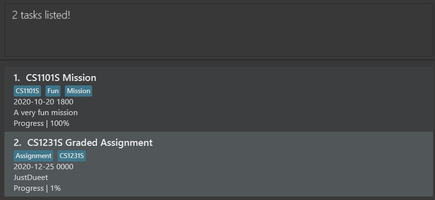
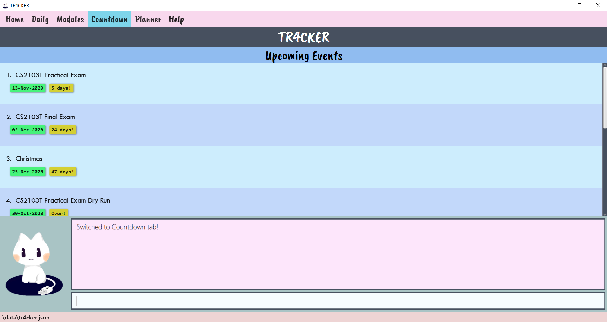
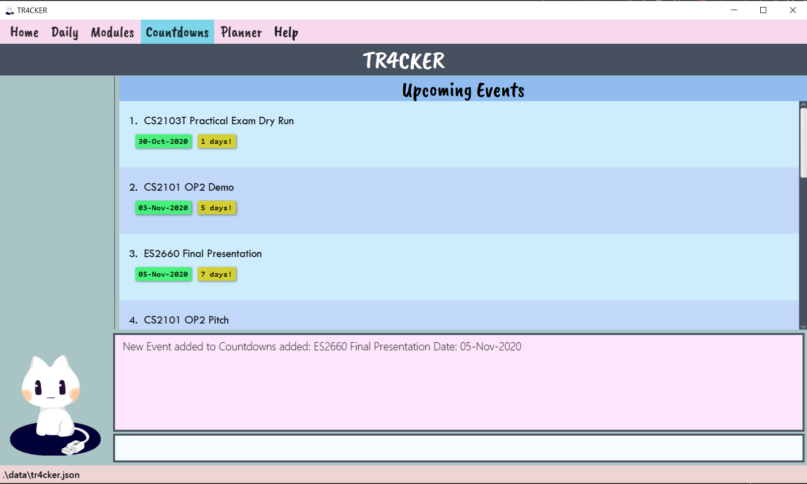
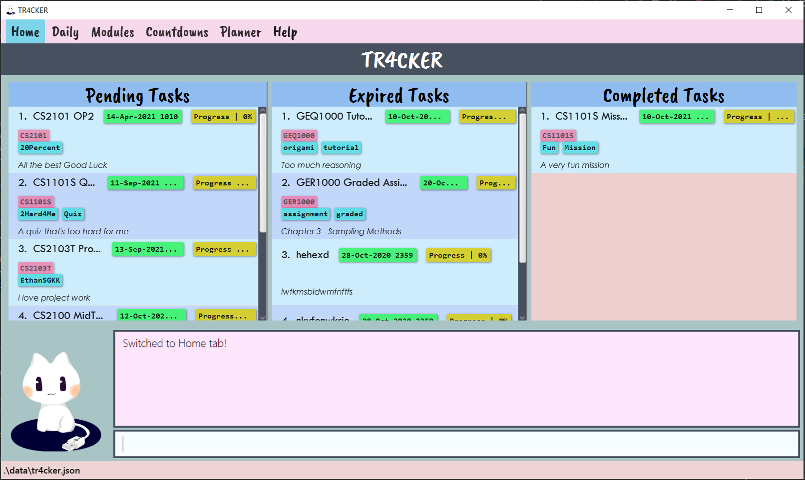
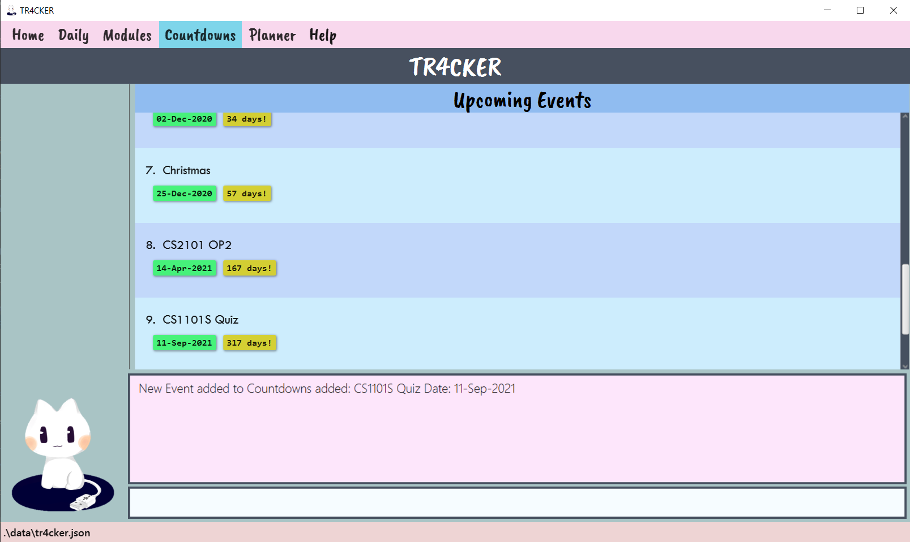

TR4CKER is a desktop app that helps SoC students track their tasks, meet their deadlines, and stay productive. It is 
optimized for Computing students familiar with Command Line Interface (CLI), who can manage their tasks efficiently by typing in commands.

* Table of Contents
{:toc}

--------------------------------------------------------------------------------------------------------------------

## Quick start

1. Ensure you have Java `11` or above installed in your Computer.

2. Download the latest `tr4cker.jar` from [here](https://github.com/AY2021S1-CS2103T-T10-2/tp/releases/tag/v1.1).

3. Copy the file to the folder you want to use as the _home folder_ for your TR4CKER.

4. Double-click the file to start the app. The GUI similar to the below should appear in a few seconds. Note how the app contains some sample data. 
   

5. Type the command in the command box and press Enter to execute it. e.g. typing **`help`** and pressing Enter will open the help window. 
   Some example commands you can try:

    * **`add`**`n/task 1 dl/2020-09-08 1700 des/task 1 description t/urgent`: Adds a task named `task 1` with description `task 1
description`, with a deadline of `8 Sep 2020, 1700 hrs` and with an `urgent` tag into TR4CKER.

    * **`done`**`1`: Marks the 1st task as done.

    * **`delete`**`3`: Deletes the 3rd task shown in the current task list.

    * **`edit`**`1 n/actually task 2`: Edits 1st task's name to be `actually task 2`.

    * **`tag`**`1 new/urgent`: Adds `urgent` tag to existing tags of 1st task.

    * **`find`**`task`: Finds the tasks with `task` as a keyword.

    * **`list`**: Lists all tasks in current task list.

    * **`exit`**: Exits TR4CKER.

6. Refer to the [Features](#features) below for details of each command.

--------------------------------------------------------------------------------------------------------------------

## Features

**:information_source: Notes about the command format:** 

* Words in `UPPER_CASE` are the parameters to be supplied by the user. 
  e.g. in `add n/NAME`, `NAME` is a parameter which can be used as `add n/tP week 7`.

* Items in square brackets are optional. 
  e.g `n/ NAME [t/TAG]` can be used as `n/tP week 7 t/urgent` or as `n/tP week 7`.

* Items with `…` after them can be used multiple times including zero times. 
  e.g. `[t/TAG]…` can be used as ` ` (i.e. 0 times), `t/urgent`, `t/urgent t/cs2103t` etc.

* Parameters can be in any order. 
  e.g. if the command specifies `n/NAME dl/DEADLINE`, `dl/DEADLINE n/NAME` is also acceptable.

### Tabs
- TR4CKER
- Daily
- Modules
- Countdown
- Planner
- Help

#### TR4CKER tab features
##### Adding a new task: `add`

You can add a new task to TR4CKER.

Default deadline time would be set to 2359 if you do not provide a deadline time.

You should enter time in this format: yyyy-MM-dd HHmm

Format: `add n/NAME dl/DEADLINE des/description [t/TAG]…​`

:bulb: **Tip:**
A task can have any number of tags (including 0)

Examples:
* `add n/CS1101S Quiz dl/2020-01-25 des/Post-Lecture quiz`
* `add n/CS1231S Homework Assignment dl/2020-09-08 2200 des/task 1 description t/assignment t/urgent`

##### Listing all tasks: `list`

Shows a list of all tasks in TR4CKER.

Format: `list`

##### Marking tasks as done: `done`

Marks the tasks you have completed as 'done' in TR4CKER.

Format: `done [INDEX]`

* Marks the task as done at the specified `INDEX`.
* The index refers to a valid index number shown in the displayed task list.
* The index **must be a positive integer** 1, 2, 3, …​

Examples:
* `list` followed by `done 2` marks the 2nd task in the displayed task list as done.
* `find essay` followed by `done 1` marks the 1st task in the results of the `find` command as done.

##### Editing a task: `edit`

Edits an existing task’s details in TR4CKER.

Format: `edit INDEX [n/NAME] [dl/DEADLINE] [des/TASKDESCRIPTION]`

* Edits the task's name, deadline and description at the specified `INDEX`.
* The index refers to the index number shown in the task list.
* The index **must be a positive integer** 1, 2, 3, …​
* At least one of the optional fields must be provided.
* Existing task’s details will be updated to the new task’s details being inputted.
* Editing of tags can be done using `tag` command.

Examples:
* `edit 1 n/prepare for tP tasks` - Edits the description of the 1st task to be `prepare for tP tasks`.
* `edit 2 dl/2020-09-13 1930` - Edits the deadline time of the 2nd task to be 13 Sep 2020, 1930 hrs.

##### Editing tags: `tag`

Adds and/or deletes tag(s) from an existing task in TR4CKER.

Format: `tag INDEX [new/NEW_TAG]…​ [del/TAG_TO_DELETE]…​`

* Adds tag(s) to task at the specified `INDEX` when using `new/NEW_TAG`.
* Deletes tag(s) from task at the specified `INDEX` when using `del/TAG_TO_DELETE`.
* The index refers to the index number shown in the task list.
* The index **must be a positive integer** 1, 2, 3, …​
* At least one of the fields must be provided.
* Tag(s) will only be added if it does not exist yet.
* Tag(s) will only be deleted if it exists.
* Adding and deleting of tags can be used concurrently.
* Multiple tags can be added and deleted at the same time.

Examples:
* `tag 1 new/urgent` - Adds a new tag `urgent` to the existing tags of 1st task (if the tag does not already exist).
* `tag 2 del/assignment` - Deletes the tag `assignment` from the 2nd task (if the tag exists).
* `tag 3 new/urgent del/assignment new/graded` - Adds 2 new tags `urgent` and `graded`, deletes the tag `assignment`
from the 3rd task.

##### Locating tasks by keyword: `find`

Finds tasks whose names contain any of the given keywords.

Format: `find [KEYWORD_1] [KEYWORD_2] ...`

* The search is case-insensitive. e.g `cs2101` will match `CS2101`
* The order of the keywords does not matter. e.g. `Presentation CS2101` will match `CS2101 Presentation`
* Only the name is searched.
* Only full words will be matched e.g. `2101` will not match `CS2101`
* Tasks matching at least one keyword will be returned.
  e.g. `find CS2101 project` will return `CS2101 Oral Presentation 1`, `CS2103T team project`

Examples:
* `find CS2101` returns `CS2101 Oral Presentation 1`
* `find CS1231S Mission` returns `CS1101S Mission`, `CS1231S Graded Assignment` 
  

##### Deleting an existing task : `delete`

You can delete an existing task from the task list by providing the 
index number of the task that you want to delete.

Format: `delete INDEX`

* Deletes the task at the specified `INDEX`.
* The index refers to a valid index number shown in the displayed task list.
* The index **must be a positive integer** 1, 2, 3, …​

Examples:
* `list` followed by `delete 2` deletes the 2nd task in the displayed task list.
* `find assignment` followed by `delete 1` deletes the 1st task in the results of the `find` command.

##### Clearing all tasks: `clear`

Clears all entries from TR4CKER.

Format: `clear`

##### Exiting TR4CKER: `exit`

Exits the program.

Format: `exit`

#### Daily tab features

#### Modules tab features

#### Countdown tab features
You can countdown to your most essential upcoming events in the Countdown tab. You can know at a quick glance, how many
you have left to that Final Exam or that birthday party.

##### Switching to Countdown tab: `countdown`
To switch to the Countdown tab, simply type `planner` into the command line. You can also click on the Countdown button
on the tabs menu at the top.

Format: `countdown`
Once you have enter this command, TR4CKER should look like this:

Figure x: TR4CKER after executing `countdown`

The `Upcoming Events` panel shows the list of upcoming events that are counted down to.

Example:
* `countdown` - Switches to Countdown tab, showing the list of events.

##### Adding a new event to countdowns list
You can add an event to the list of events, and TR4CKER help you to countdown to it.

Format: `countdown n/NAME d/DATE`

* Adds an event with name `NAME` and date `DATE` to the Countdown events list.
* Both fields are compulsory and can be in any order.
* `NAME` must be in the alphanumeric format (only containing letters and numbers) and preferably under 
100 characters long.
* `DATE` must be a day in the future (i.e. NOT today or any day before today) and be in the format 
`DD-MM-YYYY` or `DD-MMM-YYYY`.

Examples:
* `countdown d/31-12-2020 n/New Years Eve Countdown Party at Scarlets` - Adds an event `New Years Eve Countdown Party
at Scarlets` with date `31-Dec-2020` to the Countdowns list of events.
* `countdown n/CS1231 Final Exam d/30-Nov-2020` - Adds an event `CS1231 Final Exam` with date `30-Nov-2020` to the
Countdowns list of events.

Figure x: TR4CKER after executing `countdown n/ES2660 Final Presentation d/05-Nov-2020`

##### Adding an event from tasks list
You can add an event that is based on a current task in the tasks list (as seen in the homepage of TR4CKER under the
pending tasks panel) to your list of countdowns. TR4CKER will help you to countdown to this event, in addition to
tracking it in the tasks list.

Format: `countdown task/INDEX`

* Converts the task at index `INDEX` of the task list into an event, and adds this event to the Countdowns events list.
* `INDEX` has to be a valid index, numbered according to the list in the home page of TR4CKER. 
* The deadline of this task needs to be a day in the future (i.e. NOT today or any day before today).
* Note: any subsequent changes to the task in the task list, such as editing the description or name of the task,
will not be reflected in the event.

Example:
* `countdown task/1` - Adds an event to the Countdowns list of events based on the task at index `1` of the tasks list.

Figure x: Home page of TR4CKER which shows the list of tasks that you can add as an event, in the `Pending Tasks` panel
on the left.

Figure x: TR4CKER after executing `countdown task/2`. The task at index `2` in Figure x is added at index `9` of the
Countdowns events list.

##### Deleting an event from countdowns list
You can delete an event from your list of events if you no longer want to countdown to it, or if it is over.

Format: `countdown del/INDEX`

* Deletes the task at index `INDEX` of the events list.
* `INDEX` has to be a valid index, numbered according to the list in Countdown tab.
* Warning: This action is irreversible!

Example:
* `countdown del/8` - Deletes the event at index `8` of the Countdowns list.

Figure x: Countdown tab of TR4CKER which shows you the current list of events.

Figure x: TR4CKER after executing `countdown del/2`. Event at index `2` of Figure x is deleted. 

#### Planner tab features
You can view an overview of your schedule in a calendar view and have your tasks list side-by-side using the Planner
tab. By having an overview of your upcoming schedule, you would be able to better manage your time and hence
be more productive!

##### Switching to Planner tab: `planner`
If you would like to switch to Planner tab without clicking on the Planner tab button, you can do so easily through the
CLI, by just typing `planner`.

Format: `planner`

Once you enter `planner` into the command box, TR4CKER should look like this:

Figure 1: TR4CKER after executing `planner`

By default, TR4CKER will circle today's date and the show you the tasks due on that day.

Example:
* `planner` - Switches to Planner tab, showing calendar view of today and tasks due today.

##### Switching calendar view and tasks list
If you would like to view the calendar on specific date/month, and with the tasks due on that date beside, you can
use this command.

General format: `planner goto/INPUT`

* Input is compulsory and the format varies on the usages.

For the ease of accessing today's and tomorrow's tasks list, TR4CKER has provided you with 2 commands that you can use!
Short forms like "tdy" for "today" and "tmr" for "tomorrow" also allow you to save time without typing the full words.
##### Today
Format: `planner goto/today` or `planner goto/tdy`

* Input can only be `today` or `tdy`. There are no other alternatives.

First, you enter the command into the command box to go to today:

Figure 2: TR4CKER before executing `planner goto/tdy`

Then, TR4CKER will change planner tab to today's calendar view and tasks due today:

Figure 3: TR4CKER after executing `planner goto/tdy`

Examples:  
These 2 examples:
* `planner goto/today`
* `planner goto/tdy`

will both give you today's calendar view and tasks due today.

##### Tomorrow
Format: `planner goto/tomorrow` or `planner goto/tmr`

* Input can only be `tomorrow` or `tmr`. There are no other alternatives.

First, you enter the command into the command box to go to tomorrow:

Figure 4: TR4CKER before executing `planner goto/tmr`

Then, TR4CKER will change planner tab to tomorrow's calendar view and tasks due tomorrow:

Figure 5: TR4CKER after executing `planner goto/tmr`

Examples:  
These 2 examples:
* `planner goto/tomorrow`
* `planner goto/tmr`

will both give you tomorrow's calendar view and tasks due tomorrow.

For the ease of accessing of a specific date's or month's tasks list, TR4CKER has provided you with 2 commands that
you can use!
##### Specific date
Format: `planner goto/dd-mm-yyyy` or `planner goto/dd-MMM-yyyy`

* Input must be a valid date.
* You can either use the month number or month name for the month field of the input date. 

First, you enter the command into the command box to go to a specific date:

Figure 6: TR4CKER before executing `planner goto/08-11-2020`

Then, TR4CKER will change planner tab to the calendar view and tasks due on the input date you provided:

Figure 7: TR4CKER after executing `planner goto/08-11-2020`

Examples:
* `planner goto/02-12-2020` - Shows you the calendar view of December 2020, with 2nd December 2020 being circled, and
shows you the tasks due on 2nd December 2020.
* `planner goto/28-Feb-2021` - Shows you the calendar view of February 2021, with 28th February 2021 being circled, and
shows you the tasks due on 28th February 2021.

##### Specific month
Format: `planner goto/mm-yyyy` or `planner goto/MMM-yyyy`

* Input must be a valid month.
* You can either use the month number or month name for the month field of the input month.

First, you enter the command into the command box to go to a specific month:

Figure 8: TR4CKER before executing `planner goto/Sep-2021`

Then, TR4CKER will change planner tab to the calendar view and tasks due on the input month you provided:

Figure 9: TR4CKER after executing `planner goto/Sep-2021`

By default, TR4CKER will circle the first day of the month you inputted and show you the tasks due on the first day of
the input month.

Examples:
* `planner goto/12-2020` - Shows you the calendar view of December 2020, with 1st December 2020 being circled, and
shows you the tasks due on 1st December 2020.
* `planner goto/Feb-2021` - Shows you the calendar view of February 2021, with 1st February 2021 being circled, and
shows you the tasks due on 1st February 2021.

##### Indicators on Calendar
You would have realised there are different colours tagged to every day in the calendar. To allow you to have a better
overview of your schedule, Planner tab allows you to check if your upcoming days are busy!

The figure below shows the indicators.

Figure 10: Indicators (circled in red) on calendar

The indicator colours and their meanings are:
* No indicator - no tasks due on that date
* Green indicator - 2 or lesser tasks due on that date
* Red indicator - more than 2 tasks due on that date

#### Help tab features
##### Viewing help : `help`

Shows a message explaining how to access the help page.

Format: `help`

##### Saving the data

TR4CKER data are saved in the hard disk automatically after any command that changes the data.
There is no need to save manually.

--------------------------------------------------------------------------------------------------------------------

## FAQ

**Q**: How do I transfer my data to another Computer? 
**A**: Install the app in the other computer and overwrite the empty data file it creates with the file that contains
the data of your previous TR4CKER home folder.

--------------------------------------------------------------------------------------------------------------------

## Command summary

Action | Format, Examples
--------|------------------
**Help** | `help`
**Add** | `add n/NAME dl/DEADLINE des/TASKDESCRIPTION [t/TAG]…​`   e.g., `add n/task 1 dl/2020-09-08 des/task 1 description t/urgent t/priority`
**Delete** | `delete INDEX`  e.g., `delete 3`
**Done** | `done INDEX`  e.g., `done 1`
**Edit** | `edit INDEX [n/NAME] [dl/DEADLINE] [des/TASKDESCRIPTION]`  e.g.,`edit 2 n/task 1 dl/2020-09-08`
**Find** | `find [KEYWORD_1] [KEYWORD_2] ...`  e.g., `find task 1`
**Clear** | `clear`
**List** | `list`
**Exit** | `exit`
