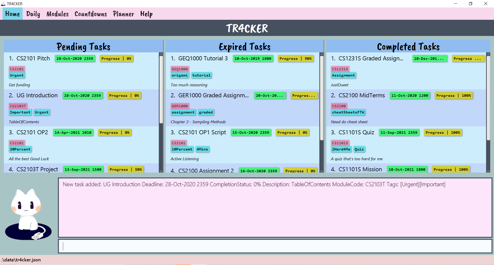
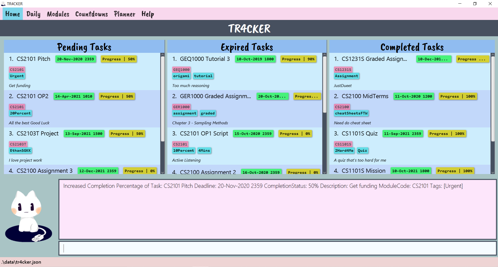
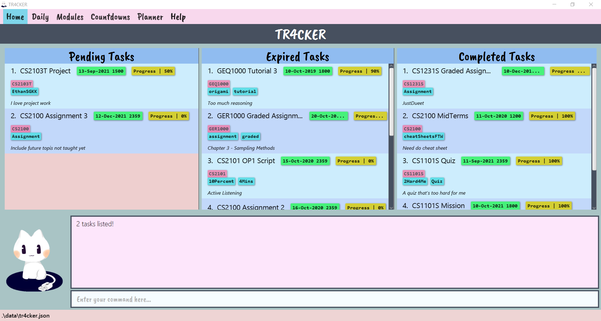
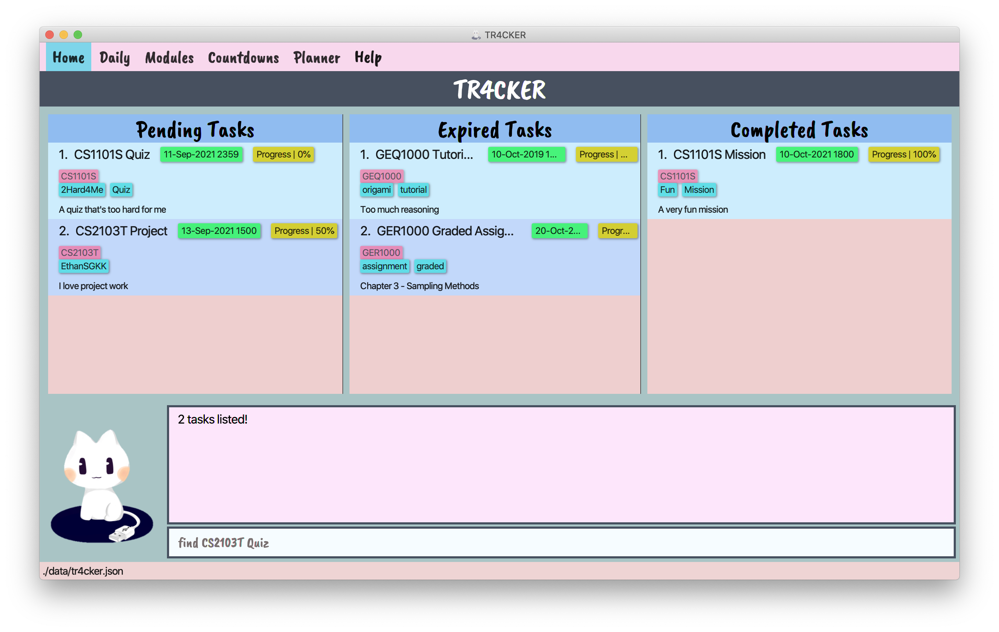
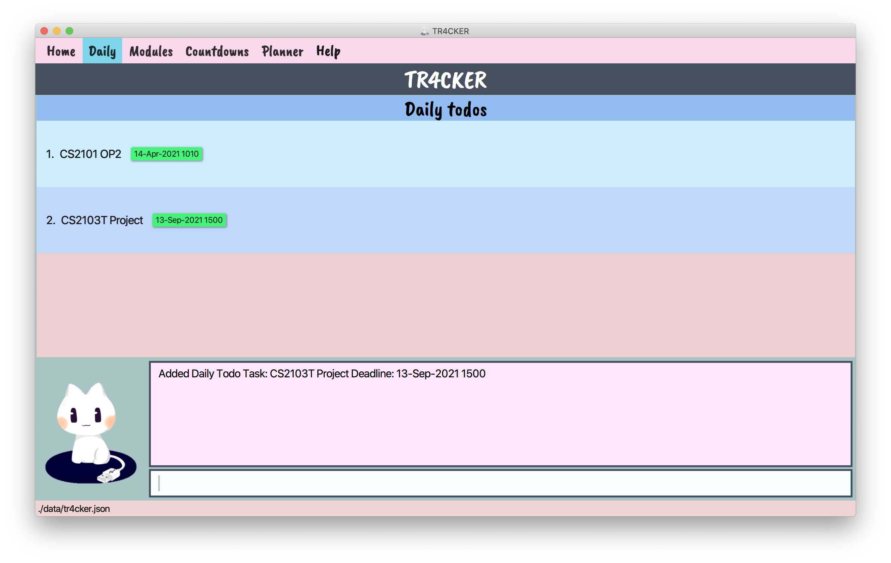

1. [Overview](#1-overview)
    * 1.1. [About TR4CKER](#11-about-tr4cker)
    * 1.2. [About this User Guide](#12-about-this-user-guide)
2. [Quick Start](#2-quick-start)
3. [Commands](#3-commands)
    * 3.1. [Common Commands](#31-common-commands)
        * 3.1.1. [Viewing help: `help`](#311-viewing-help--help)
        * 3.1.2. [Exiting the program: `exit`](#312-exiting-the-program-exit)
        * 3.1.3. [Switching between tabs](#313-switching-between-tabs)
    * 3.2. [Home Tab](#32-home-han-wei)
        * 3.2.1. [Reading the Task lists](#321-reading-the-task-lists)
        * 3.2.2. [Command format for Task list Commands](#322-command-format-for-task-list-commands)
        * 3.2.3. [Adding new tasks: `add`](#323-adding-new-tasks-add)
        * 3.2.4. [Listing all tasks: `list`](#324-listing-all-tasks-list)
        * 3.2.5. [Marking Pending tasks as done: `done`](#325-marking-tasks-as-done-done)
        * 3.2.6. [Editing Pending tasks: `edit`](#326-editing-pending-tasks-edit)
        * 3.2.7. [Editing tags of Pending tasks: `tag`](#327-editing-tags-of-pending-tasks-tag)
        * 3.2.8. [Locating Pending tasks by keywords: `find`](#328-locating-pending-tasks-by-keyword-find)
        * 3.2.9. [Deleting Pending tasks: `delete`](#329-deleting-pending-tasks--delete)
        * 3.2.10. [Editing Expired tasks: `edit expired`](#3210-editing-expired-tasks-edit-expired)
        * 3.2.11. [Deleting Expired tasks: `delete expired`](#3211-deleting-expired-tasks--delete-expired)
        * 3.2.12. [Clearing all tasks: `clear`](#3212-clearing-all-tasks-clear)
    * 3.3. [Daily Tab](#33-daily-yingqi)
        * 3.3.1. [Switching to Daily tab: `daily`](#331-switching-to-daily-tab-daily)
        * 3.3.2. [Adding a daily todo task](#332-adding-a-daily-todo-task-todo)
    * 3.4. [Modules Tab](#34-modules-ethan)
        * 3.4.1. [Switching to Module tab: `modules`](#341-switching-to-module-tab-modules)
        * 3.4.2. [Adding a new module to modules list](#342-adding-a-new-module-to-modules-list)
        * 3.4.3. [Assigning a task to a module](#343-assigning-a-task-to-a-module)
        * 3.4.4. [Un-assigning a task from a module](#344-un-assigning-a-task-from-a-module)
        * 3.4.5. [Deleting a module](#345-deleting-a-module)
    * 3.5. [Countdown Tab](#35-countdown-wen-ling)
        * 3.5.1. [Switching to Countdown tab: `countdown`](#351-switching-to-countdown-tab-countdown)
        * 3.5.2. [Adding a new event to countdowns list](#352-adding-a-new-event-to-countdowns-list)
        * 3.5.3. [Deleting an event from countdowns list](#353-deleting-an-event-from-countdowns-list)
    * 3.6. [Planner Tab](#36-planner-rui-ling)
        * 3.6.1. [Switching to Planner tab: `planner`](#361-switching-to-planner-tab-planner)
        * 3.6.2. [Switching calendar view and tasks list](#362-switching-calendar-view-and-tasks-list)
            * 3.6.2.1. [Go to today or tomorrow](#3621-go-to-today-or-tomorrow)
                * 3.6.2.1.1. [Today](#36211-today)
                * 3.6.2.1.2. [Tomorrow](#36212-tomorrow)
            * 3.6.2.2. [Go to specific date](#3622-go-to-specific-date)
            * 3.6.2.3. [Go to specific month](#3623-go-to-specific-month)
        * 3.6.3 [Indicators on Calendar](#363-indicators-on-calendar)
    * 3.7. [Saving of Data](#37-saving-the-data)
4. [FAQ](#4-faq)
5. [Command Summary](#5-command-summary)

# 1. Overview
Welcome to the User Guide of TR4CKER!

## 1.1. About TR4CKER
TR4CKER is a desktop app that helps SoC students track their tasks, meet their deadlines, and stay productive. It is
optimized for Computing students familiar with Command Line Interface (CLI), who can manage their tasks efficiently
by typing in commands.

## 1.2. About this User Guide
This User Guide explains how to use TR4CKER, as well as provides an understanding of the features and commands, and some
common use cases of this application.

In this guide, we cover:
1. How to navigate the Graphical User Interface (GUI)
2. How to use the Command Line Interface (CLI)

--------------------------------------------------------------------------------------------------------------------

# 2. Quick Start
In this section, it will guide you through on how to get TR4CKER started for the first time.

1. Ensure you have Java `11` or above installed in your Computer.

2. Download the latest `tr4cker.jar` from [here](https://github.com/AY2021S1-CS2103T-T10-2/tp/releases/tag/v1.3).

3. Copy the file to the folder you want to use as the _home folder_ for your TR4CKER.

4. Double-click the file to start the app. The GUI similar to the below should appear in a few seconds. Note how the app contains some sample data. 
   

   Figure 1: Application home page populated with sample data

--------------------------------------------------------------------------------------------------------------------
# 3. Commands

**:information_source: Notes about the command format:** 

* Words in `UPPER_CASE` are the parameters to be supplied by the user. 
  e.g. in `add n/NAME`, `NAME` is a parameter which can be used as `add n/tP week 7`.

* Items in square brackets are optional. 
  e.g `n/ NAME [t/TAG]` can be used as `n/tP week 7 t/urgent` or as `n/tP week 7`.

* Items with `…` after them can be used multiple times including zero times. 
  e.g. `[t/TAG]…` can be used as ` ` (i.e. 0 times), `t/urgent`, `t/urgent t/cs2103t` etc.

* Parameters can be in any order. 
  e.g. if the command specifies `n/NAME dl/DEADLINE`, `dl/DEADLINE n/NAME` is also acceptable.

## 3.1. Common Commands
Here are some commands that you might find it handy when using TR4CKER. 

### 3.1.1. Viewing help : `help`
If you cannot recall the command you need, you can enter the help command in any panel.
A help window will pop out with a link to this User Guide.

Figure 2: Expected result after running `help`

### 3.1.2. Exiting the program: `exit`

You can exit the program anytime by entering the `exit` command in any panel.

Format: `exit`

### 3.1.3. Switching between tabs

You can switch between tabs by using the following commands:

| Command    | Tab switched to |
| :----------| :--------------:|
|  `home`    | Home            |
|  `daily`   | Daily           |
|  `modules`     | Modules         |
| `countdown`| Countdowns      |
|  `planner` | Planner         |

Table 1: List of Switch Tab commands

## 3.2. Home (Han Wei)

TR4CKER is primarily a task management application that allows you to track and manage your tasks comprehensively.

TR4CKER's Home page was built for this purpose and you will be directed to this page once you start TR4CKER. Alternatively,
 you can enter `home` on the Command Box to navigate to this page.

### 3.2.1. Reading the Task lists

For the ease of reading, tasks are split into 3 sections and are displayed separately, namely:
1. Pending Tasks
2. Expired Tasks
3. Completed Tasks

Figure 3: Application home page populated by sample data

The leftmost panel displays Pending tasks that are not overdue and not completed.
On the other hand, the Expired Tasks panel displays tasks that are overdue but have yet to be completed.
Lastly, the Completed Tasks panel displays completed tasks for archive purposes.

### 3.2.2. Command format for Task list Commands

The syntax of the `add` command is `add n/NAME des/DESCRIPTION [m/MODULE_CODE] [dl/DEADLINE] [t/TAG]... ` and it will be used as an
example to explain the following points:

**:information_source: Notes about the command format:** 

1. Parts of the command in UPPER_CASE represent command parameters that have to be supplied by you. Using the given example,
DESCRIPTION represents a field where you provide the task description, such as des/Graded assignment 2.

2. Parameters in square brackets are optional, such as the Tag parameter in the given example.

3. Parameters with a trailing `...` are optional and may be used as many times as you want, or even be omitted.

4. Parameters can be entered in any order.

### 3.2.3. Adding new tasks: `add`

You can add a task to TR4CKER using the `add` command when you want to start working on a new task.

Format: `add n/NAME des/DESCRIPTION [m/MODULE_CODE] [dl/DEADLINE] [t/TAG]…​`

Figure 4: Example of an expected result after executing `add n/UG Introduction des/TableOfContents m/CS2103T t/Urgent t/Important`

Before you can add a task with module, you need to ensure that the module is already entered into TR4CKER.
You can refer to the section on Module Tab to find out more.

**:information_source: Important points to note when entering Deadline:** 

1. While Deadline is an optional parameter, TR4CKER will set the Deadline to default values if you do not enter them:
    * If you do not enter a Deadline, it will be set to Today, 2359.
    * If you enter a Deadline date without specifying a time, Deadline time will be set to 2359.
2. DateTime formats accepted for Deadline:
    * dd-MM-yyyy HHmm, dd-MMM-yyy HHmm, dd-MM-yyy, dd-MMM-yyyy
        * dd: the corresponding days in 2 numbers.
        * MM: the corresponding month in 2 numbers.
        * MMM: the corresponding month in 3 letters (First letter must be capitalised, e.g. Jan, Sep).
        * yyyy: the corresponding year in 4 numbers.
        * HH: the hour the task is due, in 24-Hour format.
        * mm: the minute the task is due.
    * Natural Dates
        * Today
        * Days of week (e.g. Monday, Sunday)
            * If Monday is entered, it refers to the upcoming Monday.

:bulb: **Tip:**
Tags cannot contain spaces and must be alphanumeric!

Examples:
* `add n/tP PE m/CS2103T des/Practical Exam`
* `add n/CS1101S Quiz dl/25-11-2020 m/CS1101S des/Post-Lecture quiz`
* `add n/CS1231S Homework Assignment dl/today 2200 m/CS1231S des/Chapter 3 t/graded t/assignment`

### 3.2.4. Listing all tasks: `list`

Displays a list of all tasks names in TR4CKER.

Format: `list`

### 3.2.5. Marking tasks as done: `done`

TR4CKER allows you to track the progress of a task in TR4CKER and you can use the `done` command when you want to update the Completion Status of a task.

Format: `done INDEX [p/COMPLETION_STATUS]`

Figure 5: Example of an expected result after executing `done 1 p/50`

* Marks the task as done at the specified `INDEX`.
* The index refers to a valid index number shown in the specified Pending Tasks list.
* The index **must be a positive integer** 1, 2, 3, …​
* Completion Status is a percentage of task done and therefore only accept integer values from 0 to 100.
* If Completion Status is not entered, TR4CKER will mark the task as 100% done.

:bulb: **Tip:**
Completion Status can either be increased or decreased!

Examples:
* `list` followed by `done 2 p/50` marks the 2nd task in the displayed task list as 50% done.
* `find tutorial` followed by `done 1` marks the 1st task in the results of the `find` command as 100% done.

### 3.2.6. Editing Pending tasks: `edit`

You can edit an existing Pending task in TR4CKER by using the `edit` command when the need arises.

Format: `edit INDEX [n/NAME] [dl/DEADLINE] [des/DESCRIPTION]`

* Edits the task's name, deadline and description at the specified `INDEX`.
* The index refers to the index number shown in the task list.
* The index **must be a positive integer** 1, 2, 3, …​
* At least one of the optional fields must be provided.
* Editing of tags is done using `tag` command instead (Refer to the TagCommand section).

Examples:
* `edit 1 n/prepare for tP tasks` - Edits the description of the 1st task to be `prepare for tP tasks`.
* `edit 2 dl/13-Dec-2020 1930` - Edits the deadline time of the 2nd task to be 13 Dec 2020, 1930 hrs.

### 3.2.7. Editing tags of Pending tasks: `tag`

You can add or delete tags of a Pending task in TR4CKER.

Format: `tag INDEX [new/NEW_TAG]…​ [del/TAG_TO_DELETE]…​`

* Adds tag(s) to task at the specified `INDEX` when using `new/NEW_TAG`.
* Deletes tag(s) from task at the specified `INDEX` when using `del/TAG_TO_DELETE`.
* The index refers to the index number shown in the task list.
* The index **must be a positive integer** 1, 2, 3, …​
* At least one of the fields must be provided.
* Tag(s) will only be added if it does not exist yet.
* Tag(s) will only be deleted if it exists.
* Adding and deleting of tags can be used concurrently.
* Multiple tags can be added and deleted at the same time.

Examples:
* `tag 1 new/urgent` - Adds a new tag `urgent` to the existing tags of 1st task (if the tag does not already exist).
* `tag 2 del/assignment` - Deletes the tag `assignment` from the 2nd task (if the tag exists).
* `tag 3 new/urgent del/assignment new/graded` - Adds 2 new tags `urgent` and `graded`, deletes the tag `assignment`
from the 3rd task.

### 3.2.8. Locating Pending tasks by keyword: `find`

You can find tasks whose names contain any of the given keywords.

Format: `find [KEYWORD_1] [KEYWORD_2] ...`

Figure 6: Example of an expected result after executing `find cs2103T Assignment`

* The search is case-insensitive. e.g `cs2103T` will match `CS21013T`
* The order of the keywords does not matter. e.g. `Assignment CS2103T` will match `CS2103T Assignment`
* Only the name is searched.
* Only full words will be matched e.g. `2101` will not match `CS2101`
* Tasks matching at least one keyword will be returned.
  e.g. `find CS2103T Assignment` will return `CS2103T Project`, `CS2100 Assignment 3`

Examples:
* `find CS2101` returns `CS2101 Oral Presentation 1`
* `find CS2103T Quiz` returns `CS2103T Project`, `CS1101S Quiz` 
  

### 3.2.9. Deleting Pending tasks : `delete`

You can delete an existing task from the task list by providing the
index number of the task that you want to delete.

Format: `delete INDEX`

* Deletes the task at the specified `INDEX`.
* The index refers to a valid index number shown in the displayed task list.
* The index **must be a positive integer** 1, 2, 3, …​

Examples:
* `list` followed by `delete 2` deletes the 2nd task in the displayed task list.
* `find assignment` followed by `delete 1` deletes the 1st task in the results of the `find` command.

### 3.2.10. Editing Expired tasks: `edit expired`

The usage of this command is similar to the `edit` command for a Pending task.

Format: `edit expired INDEX [n/NAME] [dl/DEADLINE] [des/DESCRIPTION]`

**:information_source: If you edit the Deadline of an Expired Task:** 

Editing the Deadline of an Expired task will turn the task into a Pending task because new Deadline entered
must be a future Deadline. Hence, the edited task will be displayed under the Pending Task panel instead.

### 3.2.11. Deleting Expired tasks : `delete expired`

The usage of this command is similar to the `delete` command for a Pending task.

Format: `delete expired INDEX`

* Deletes the task at the specified `INDEX`.
* The index refers to a valid index number shown in the displayed task list.
* The index **must be a positive integer** 1, 2, 3, …​

Examples:
* `list` followed by `delete 2` deletes the 2nd task in the displayed task list.
* `find assignment` followed by `delete 1` deletes the 1st task in the results of the `find` command.

### 3.2.12. Clearing all tasks: `clear`

Clears all entries in TR4CKER.

Format: `clear`

## 3.3 Daily (Yingqi)
You can add all your daily plans of current tasks to a daily to do list so that you have a clearer idea of what you want to complete for the day.

### 3.3.1 Switching to Daily tab: `daily`
If you would like to switch to Daily tab without clicking on the Daily tab button, you can do so easily through the CLI, by just typing `daily`.

Format: `daily`

Once you enter `daily` into the command box, TR4CKER should look like this:

Figure 7: TR4CKER after executing `daily`

Example:
* `daily` - Switches to Daily tab, showing a list of daily todo tasks that you have planned for the day.

### 3.3.2 Adding a daily todo task: `todo`

You can add a todo task for the day into the daily todo list by providing the index number of the task that you want to add.

Format: `todo INDEX` [To be implemented: add multiple todo tasks at the same time]

* Adds the task at the specified `INDEX` to daily todo list.
* The index refers to a valid index number shown in the displayed task list.
* The index **must be a positive integer** 1, 2, 3, …​

Examples:
* `list` followed by `todo 1` adds the first task in the displayed task list into daily todo list.

Figure 8: Daily tab before executing `todo 1`

Figure 9: Daily tab after executing `todo 1`

## 3.4. Modules (Ethan)

You can organize your tasks according to their respective modules using the Module tab. Categorizing tasks by module
allows you to know exactly how many tasks are still due for each of the modules you take, if you wish to work on a
particular module first.

### 3.4.1 Switching to Module tab: `modules`
To switch to the Module tab, simply type `modules` into the command line. You can also click on the Module button on the tabs
menu at the top.

Format: `modules`

1. You enter `modules` into the command box.

Figure 10: TR4CKER before executing `modules`

2. Press enter and TR4CKER should switch to the Module tab:

Figure 11: TR4CKER after executing `modules`

:bulb: **Note:**

The `All Modules` panel shows the list of all modules and their tasks. 
The page will be blank if no modules have been created yet.

Example:
* `modules` - Switches to Module tab, showing the list of modules.

### 3.4.2 Adding a new module to modules list:
You can add a new module to the list of modules, that TR4CKER can use to categorize tasks.

Format: `modules n/NAME m/MODULECODE`

* Adds a module with name `NAME` and module code `MODULECODE` to the modules list.
* Both fields are compulsory and can be in any order.
* `NAME` must be in the alphanumeric format (only containing letters and numbers) and preferably under
100 characters long, so that it can be displayed in the box without being truncated.
* `MODULECODE` must be in the alphanumeric format (only containing letters and numbers) and must not include any spacings.
* `MODULECODE` is case-insensitive.
* The keyword `DEL` is not a valid `MODULECODE`.

Examples:
* `modules n/Computer Graphics m/CS3241` - Adds a module `Computer Graphics` with module code `CS3241`
to the modules list.
* `modules n/Effective Communication for Computing Professionals m/CS2101` - Adds a module `Effective Communication
for Computing Professionals` with module code `CS2101` to the modules list.

1. You enter a command into the command box to create a module, let's say Computer Graphics with module code CS3241.

Figure 12: TR4CKER before executing `modules n/Computer Graphics m/CS3241`

2. Press enter and the module should appear at the bottom of the modules list:

Figure 13: TR4CKER after executing `modules n/Computer Graphics m/CS3241`

### 3.4.3 Assigning a task to a module
Now with modules being created in the previous section, you may want to start assigning tasks to those modules.
This will be done through the edit command in [_section 3.2.6_](#326-editing-pending-tasks-edit).

Format: `edit INDEX [m/MODULECODE]`

* Edits the task at the specified `INDEX` to have module code `MODULECODE`.
* The index refers to a valid index number shown in the Pending Tasks list.
* The index **must be a positive integer** 1, 2, 3, …
* At least one of the optional fields must be provided.
* The module code `MODULECODE` must match one of the module codes of a module in the modules list.
* Note: Editing a task that already has a module assigned will replace it with the edited module.

Examples:
* `edit 1 m/CS3241` - Edits the 1st task to be tagged to the module with module code `CS3241`.

**:information_source: Assigning a module code when creating a Task:** 

The optional field `[m/MODULECODE]` can be used in a similar way as other optional fields.
For example, it can be included when using the `add` command in [_section 3.2.3_](#323-adding-new-tasks-add),
to assign tasks to modules straight away.

1. You enter a command into the command box to assign a module, let's say to assign task 1 to CS3241.

Figure 14: TR4CKER before executing `edit 3 m/CS3241`

2. Press enter and the module code should have been tagged with the module code.

Figure 15: TR4CKER after executing `edit 3 m/CS3241`

3. Switch to the Module tab, and the task should appear under CS3241.

Figure 16: TR4CKER updated Module tab after executing `edit 3 m/CS3241`

As seen from *Figure 12* and *Figure 13* above, module codes tagged onto tasks will appear as a pink coloured tag under the
tasks' name.

### 3.4.4 Un-assigning a task from a module
Maybe you have assigned the wrong module to your task? Or maybe you just want to get rid of it. Modules can be un-assigned
from tasks in a similar way to the previous section.

Format: `edit INDEX m/del`

* Deletes module code assignment from task at the specified `INDEX`.
* The index refers to a valid index number shown in the Pending Tasks list.
* The index **must be a positive integer** 1, 2, 3, …
* Instead of providing a module code with `m/MODULECODE`, the input `m/del` signifies deleting a module code.

Examples:
* `edit 3 m/del` - Deletes the module code from the 3rd task.

1. You enter a command into the command box to delete a module assignment, let's say from tasks 1.

Figure 17: TR4CKER before executing `edit 1 m/del`

2. Press enter and the module should be unassigned from task 1.

Figure 18: TR4CKER after executing `edit 1 m/del`

### 3.4.5 Deleting a module
After finishing up a semester and bringing things to a close, it's time to remove these modules as you will not be
needing them anymore. 
Make sure that no remaining tasks are still assigned to the module first before you can delete it.

Format: `modules del/INDEX`

* Deletes a module at the specified `INDEX`.
* The index refers to a valid index number shown in the module list.
* The index **must be a positive integer** 1, 2, 3, …
* Warning: This action is irreversible!

Examples:
* `modules del/1` - Deletes the 1st module in the modules list.

1. You enter a command into the command box to delete a module, let's say module number 9 that we created previously.

Figure 19: TR4CKER before executing `modules del/9`

2. Press enter and the module should be removed from the list.

Figure 20: TR4CKER after executing `modules del/9`

## 3.5. Countdown (Wen Ling)
You can countdown to your most essential upcoming events in the Countdown tab. You can know at a quick glance, how many
you have left to that Final Exam or that birthday party.

### 3.5.1. Switching to Countdown tab: `countdown`
To switch to the Countdown tab, simply type `countdown` into the command line. You can also click on the Countdown button
on the tabs menu at the top.

Format: `countdown`

Once you have entered this command, TR4CKER should look like this:

Figure 21: TR4CKER after executing `countdown`

The `Upcoming Events` panel shows the list of upcoming events that are counted down to.

Example:
* `countdown` - Switches to Countdown tab, showing the list of events.

### 3.5.2. Adding a new event to countdowns list
You can add an event to the list of events, and TR4CKER helps you to countdown to it.

Format: `countdown n/NAME d/DATE`

* Adds an event with name `NAME` and date `DATE` to the Countdown events list.
* Both fields are compulsory and can be in any order.
* `NAME` must be in the alphanumeric format (only containing letters and numbers) and preferably under
100 characters long, so that it can be displayed in the box without being truncated.
* `DATE` must be a day in the future (i.e. NOT today or any day before today) and be in the format
`DD-MM-YYYY` or `DD-MMM-YYYY`.

Examples:
* `countdown d/31-12-2020 n/New Years Eve Countdown Party at Scarlets` - Adds an event `New Years Eve Countdown Party
at Scarlets` with date `31-Dec-2020` to the Countdowns list of events.
* `countdown n/CS1231 Final Exam d/30-Nov-2020` - Adds an event `CS1231 Final Exam` with date `30-Nov-2020` to the
Countdowns list of events.

Figure 22: TR4CKER after executing `countdown n/ES2660 Final Presentation d/30-Nov-2020`

### 3.5.3. Deleting an event from countdowns list
You can delete an event from your list of events if you no longer want to countdown to it, or if it is over.

Format: `countdown del/INDEX`

* Deletes the task at index `INDEX` of the events list.
* `INDEX` has to be a valid index, numbered according to the list in Countdown tab.
* Warning: This action is irreversible!

Example:
* `countdown del/8` - Deletes the event at index `8` of the Countdowns list.

Figure 23: Countdown tab of TR4CKER which shows you the current list of events.

Figure 24: TR4CKER after executing `countdown del/2`. Event at index `2` of Figure 22 is deleted.

## 3.6. Planner (Rui Ling)
You can view an overview of your schedule in a calendar view and have your tasks list side-by-side using the Planner
tab. By having an overview of your upcoming schedule, you would be able to better manage your time and hence
be more productive!

### 3.6.1. Switching to Planner tab: `planner`
If you would like to switch to Planner tab without clicking on the Planner tab button, you can do so easily through the
CLI, by just typing `planner`.

Format: `planner`

1. You enter `planner` into the command box.

Figure 25: TR4CKER before executing `planner`

2. Press enter and TR4CKER should switch to Planner tab.

Figure 26: TR4CKER after executing `planner`

:bulb: **Note:**
By default, TR4CKER will circle today's date and the show you the tasks due on that day.
In this User Guide, today's date is taken as 7 November 2020.

Example:
* `planner` - Switches to Planner tab, showing calendar view of today and tasks due today.

### 3.6.2. Switching calendar view and tasks list
If you would like to view the calendar on specific date/month, and with the tasks due on that date beside, you can
use the different commands as explained below.

#### 3.6.2.1. Go to today or tomorrow
For the ease of accessing today's and tomorrow's tasks list, TR4CKER has provided you with 2 commands that you can use!
Short forms like "tdy" for "today" and "tmr" for "tomorrow" also allow you to save time without typing the full words.

##### 3.6.2.1.1. Today
You can view today's tasks list using this command.

Format: `planner goto/today` or `planner goto/tdy`

1. You enter the command into the command box to navigate to today.

Figure 27: TR4CKER before executing `planner goto/tdy`

2. Press enter and TR4CKER will change planner tab to today's calendar view and tasks due today.

Figure 28: TR4CKER after executing `planner goto/tdy`

:bulb: **Note:**
Input can only be `today` or `tdy`. There are no other alternatives.

Examples:
* `planner goto/today`
* `planner goto/tdy` 
will both give you today's calendar view and tasks due today.

##### 3.6.2.1.2. Tomorrow
You can view tomorrow's tasks list using this command.

Format: `planner goto/tomorrow` or `planner goto/tmr`

1. You enter the command into the command box to navigate to tomorrow.

Figure 29: TR4CKER before executing `planner goto/tmr`

2. Press enter and TR4CKER will change planner tab to tomorrow's calendar view and tasks due tomorrow.

Figure 30: TR4CKER after executing `planner goto/tmr`

:bulb: **Note:**
Input can only be `tomorrow` or `tmr`. There are no other alternatives.

Examples:
* `planner goto/tomorrow`
* `planner goto/tmr` 
will both give you tomorrow's calendar view and tasks due tomorrow.

### 3.6.2.2. Go to specific date
For the ease of accessing of a specific date's tasks list, TR4CKER has provided you this command that you can use!

Format: `planner goto/DATE`

1. You enter the command into the command box to navigate to a specific date, let's say 27 October 2020.

Figure 31: TR4CKER before executing `planner goto/27-10-2020`

2. Press enter and TR4CKER will change planner tab to the date's calendar view and tasks due on that date.

Figure 32: TR4CKER after executing `planner goto/27-10-2020`

**:information_source: Important points to note when entering the date:** 
The formats accepted for date are:
* dd-MM-yyyy and dd-MMM-yyyy
    * dd: the corresponding days in 2 numbers
    * MM: the corresponding month in 2 numbers
    * MMM: the corresponding month in 3 letters (First letter must be capitalised, e.g. Jan, Sep)
    * yyyy: the corresponding year in 4 numbers
    

Examples:
* `planner goto/02-12-2020` - Shows you the calendar view of December 2020, with 2nd December 2020 being circled, and
shows you the tasks due on 2nd December 2020.
* `planner goto/28-Feb-2021` - Shows you the calendar view of February 2021, with 28th February 2021 being circled, and
shows you the tasks due on 28th February 2021.

### 3.6.2.3. Go to specific month
For the ease of accessing of a specific month's tasks list, TR4CKER has provided you this command that you can use!

Format: `planner goto/MONTH`

1. You enter the command into the command box to navigate to a specific month, let's say September 2021.

Figure 33: TR4CKER before executing `planner goto/Sep-2021`

2. Press enter and TR4CKER will change planner tab to the month's calendar view and tasks due on first day of the month.

Figure 34: TR4CKER after executing `planner goto/Sep-2021`

:bulb: **Note:**
By default, TR4CKER will circle the first day of the month you inputted and show you the tasks due on the first day of
the input month.

**:information_source: Important points to note when entering the month:** 
The formats accepted for month are:
* MM-yyyy and MMM-yyyy
    * MM: the corresponding month in 2 numbers
    * MMM: the corresponding month in 3 letters (First letter must be capitalised, e.g. Jan, Sep)
    * yyyy: the corresponding year in 4 numbers
    

Examples:
* `planner goto/12-2020` - Shows you the calendar view of December 2020, with 1st December 2020 being circled, and
shows you the tasks due on 1st December 2020.
* `planner goto/Feb-2021` - Shows you the calendar view of February 2021, with 1st February 2021 being circled, and
shows you the tasks due on 1st February 2021.

### 3.6.3. Indicators on Calendar
You would have realised there are different colours tagged to every day in the calendar. To allow you to have a better
overview of your schedule, Planner tab allows you to check if your upcoming days are busy!

The figure below shows the indicators:

Figure 35: Indicators (circled in red) on calendar

The indicator colours and their meanings are:
* No indicator - no tasks due on that date
* Green indicator - 2 or lesser tasks due on that date
* Red indicator - more than 2 tasks due on that date

## 3.7. Saving the data

TR4CKER saves data in the hard disk automatically after any command that changes the data.
There is no need to save manually.

--------------------------------------------------------------------------------------------------------------------

# 4. FAQ

**Q**: How do I transfer my data to another Computer? 
**A**: Install the app in the other computer and overwrite the empty data file it creates with the file that contains
the data of your previous TR4CKER home folder.

**Q**: Is TR4CKER free? 
**A**: Yes! TR4CKER is totally free to use.

**Q**: Where can I find the latest version of TR4CKER? 
**A**: You can download the latest **tr4cker.jar** from [here](https://github.com/AY2021S1-CS2103T-T10-2/tp/releases).

**Q**: What do I do if my tasks expire? 
**A**: Don't worry, you can still edit or delete them using these commands:
[Edit expired](#3210-editing-expired-tasks-edit-expired) & [Delete expired](#3211-deleting-expired-tasks--delete-expired).

**Q**: Can I add multiple items at once? Multiple tasks / modules / countdowns, together in one line? 
**A**: Unfortunately, TR4CKER can only do one at a time.

**Q**: Can I manually make changes to TR4CKER's save file? 
**A**: This is **NOT** recommended as you could corrupt the save file, but it is possible.

**Q**: Do I need an internet connection? 
**A**: Once you have downloaded TR4CKER, you can continue to use it without internet connection.

**Q**: Is TR4CKER available on my mobile device? 
**A**: TR4CKER is only available on desktop for now, but we are hoping to include mobile support in version 2.0!

--------------------------------------------------------------------------------------------------------------------

# 5. Command summary

| Tab | Command | Command Format | 
| --- | ------- | -------------- |
| - | Clear all tasks | `clear` |
| - | Help | `help` |
| - | Exit TR4CKER | `exit` |
| - | Switch to TR4CKER tab | `home` |
| - | Switch to Daily tab | `daily` |
| - | Switch to Modules tab | `modules` |
| - | Switch to Countdown tab | `countdown` |
| - | Switch to Planner tab | `planner` |
| TR4CKER | Add tasks | `add n/NAME des/DESCRIPTION [dl/DEADLINE] [m/MODULE_CODE] [t/TAG]...` |
| TR4CKER | Delete Expired tasks | `delete expired INDEX` |
| TR4CKER | Delete Pending tasks | `delete INDEX` |
| TR4CKER | Edit Expired tasks | `edit expired INDEX [n/NAME] [dl/DEADLINE] [des/DESCRIPTION]` |
| TR4CKER | Edit Pending tasks | `edit INDEX [n/NAME] [des/DESCRIPTION] [dl/DEADLINE]` |
| TR4CKER | Edit Tags of Pending tasks | `tag INDEX [old/TAG_TO_DELETE]... [new/NEW_TAG]...` |
| TR4CKER | Find Pending tasks | `find [KEYWORD]...` |
| TR4CKER | List tasks | `list` |
| TR4CKER | Mark tasks as done | `done INDEX [p/COMPLETION_STATUS]` |
| Daily | Add todo tasks | `todo INDEX` |
| Modules | Add new modules to modules list | `modules n/NAME m/MODULECODE` |
| Modules | Assign tasks to modules | `edit INDEX [m/MODULECODE]`|
| Modules | Delete modules | `modules del/INDEX` |
| Modules | Un-assign tasks from modules | `edit INDEX m/del` |
| Countdown | Add new events to countdowns list | `countdown n/NAME d/DATE` |
| Countdown | Delete events from countdowns list | `countdown del/INDEX` |
| Planner | View a specific date's tasks in planner tab | `planner goto/DATE` |
| Planner | View a specific month's tasks in planner tab | `planner goto/MONTH` |
| Planner | View today's tasks in planner tab | `planner goto/today` or `planner goto/tdy` |
| Planner | View tomorrow's tasks in planner tab | `planner goto/tomorrow` or `planner goto/tmr` |
