

1. [Overview](#1-overview)
    * 1.1. [About TR4CKER](#11-about-tr4cker)
    * 1.2. [About this User Guide](#12-about-this-user-guide)
2. [Quick Start](#2-quick-start)
3. [Commands](#3-commands)
    * 3.1. [Common Commands](#31-common-commands)
        * 3.1.1. [Viewing help: `help`](#311-viewing-help--help)
        * 3.1.2. [Exiting the program: `exit`](#312-exiting-the-program-exit)
        * 3.1.3. [Switching between tabs](#313-switching-between-tabs)
    * 3.2. [Home Tab](#32-home-han-wei)
        * 3.2.1. [Switching to the Home tab: `home`](#321-switching-to-the-home-tab-home)
        * 3.2.2. [Reading the Task lists](#322-reading-the-task-lists)
        * 3.2.3. [Adding new tasks: `add`](#323-adding-new-tasks-add)
        * 3.2.4. [Listing Pending tasks: `list`](#324-listing-pending-tasks-list)
        * 3.2.5. [Marking Pending tasks as done: `done`](#325-marking-pending-tasks-as-done-done)
        * 3.2.6. [Editing Pending tasks: `edit`](#326-editing-pending-tasks-edit)
        * 3.2.7. [Editing tags of Pending tasks: `tag`](#327-editing-tags-of-pending-tasks-tag)
        * 3.2.8. [Locating Pending tasks by keywords: `find`](#328-locating-pending-tasks-by-keyword-find)
        * 3.2.9. [Deleting Pending tasks: `delete`](#329-deleting-pending-tasks--delete)
        * 3.2.10. [Editing Expired tasks: `edit expired`](#3210-editing-expired-tasks-edit-expired)
        * 3.2.11. [Deleting Expired tasks: `delete expired`](#3211-deleting-expired-tasks--delete-expired)
        * 3.2.12. [Resetting all data: `reset`](#3212-resetting-all-data-reset)
    * 3.3. [Daily Tab](#33-daily-yingqi)
        * 3.3.1. [Switching to Daily tab: `daily`](#331-switching-to-daily-tab-daily)
        * 3.3.2. [Adding a daily todo task](#332-adding-a-daily-todo-task-todo)
        * 3.3.3. [Editing a daily todo task](#333-editing-a-daily-todo-task)
        * 3.3.4. [Deleting a daily todo task](#334-deleting-a-daily-todo-task)
        * 3.3.5. [Expired and Completed todo tasks](#335-expired-and-completed-todo-tasks)
    * 3.4. [Modules Tab](#34-modules-ethan)
        * 3.4.1. [Switching to Module tab: `modules`](#341-switching-to-module-tab-modules)
        * 3.4.2. [Adding a new module to modules list](#342-adding-a-new-module-to-modules-list)
        * 3.4.3. [Assigning a task to a module](#343-assigning-a-task-to-a-module)
        * 3.4.4. [Un-assigning a task from a module](#344-un-assigning-a-task-from-a-module)
        * 3.4.5. [Deleting a module](#345-deleting-a-module)
        

    * 3.5. [Countdown Tab](#35-countdown-wen-ling)
        * 3.5.1. [Switching to Countdown tab: `countdown`](#351-switching-to-countdown-tab-countdown)
        * 3.5.2. [Adding a new event to countdowns list](#352-adding-a-new-event-to-countdowns-list)
        * 3.5.3. [Deleting an event from countdowns list](#353-deleting-an-event-from-countdowns-list)
        * 3.5.4. [Counting the number of events in `X` days](#354-counting-the-number-of-events-in-x-days)
    * 3.6. [Planner Tab](#36-planner-rui-ling)
        * 3.6.1. [Switching to Planner tab: `planner`](#361-switching-to-planner-tab-planner)
        * 3.6.2. [Switching calendar view and tasks list](#362-switching-calendar-view-and-tasks-list)
            * 3.6.2.1. [Go to today or tomorrow](#3621-go-to-today-or-tomorrow)
                * 3.6.2.1.1. [Today](#36211-today)
                * 3.6.2.1.2. [Tomorrow](#36212-tomorrow)
            * 3.6.2.2. [Go to specific date](#3622-go-to-specific-date)
            * 3.6.2.3. [Go to specific month](#3623-go-to-specific-month)
        * 3.6.3 [Indicators on Calendar](#363-indicators-on-calendar)
    * 3.7. [Saving of Data](#37-saving-the-data)
4. [Glossary](#4-glossary)
5. [FAQ](#5-faq)
6. [Command Summary](#6-command-summary)

# 1. Overview
Welcome to the User Guide of TR4CKER! This User Guide is written for new and experienced users of TR4CKER. This User Guide
equips you with the basics of using TR4CKER, so that you can start using TR4CKER to increase your productivity right away.

## 1.1. What is TR4CKER?
TR4CKER is a desktop app that helps School of Computing (SoC) students track their tasks, meet their deadlines, and stay
productive. It is optimized for Computing students who are familiar with Command Line Interface (CLI), who can manage
their tasks efficiently by typing in commands.

## 1.2. About this User Guide
This User Guide explains how to use TR4CKER, by giving you an understanding of the features and commands, as well as
providing some common use cases of this application.

This guide uses the following features to make it easier for you to navigate around: 

| Symbol | What does it mean? |
| ------ | ------------------ |
| `Command` | A command that you can type into TR4CKER |
| :information_source: | Important notes to take note of when using TR4CKER |
| :bulb: | Tips and tricks to make it easier to use TR4CKER |
| :warning: | Warnings that you need to take note of |

Table 1: Common symbols used in this User Guide

--------------------------------------------------------------------------------------------------------------------

# 2. Quick Start
This section guides you through how to get TR4CKER started for the first time.

1. Ensure you have Java `11` or above installed in your Computer.

2. TR4CKER works best on screen resolutions of at least `1600x900`.

3. Download the latest `tr4cker.jar` from [here](https://github.com/AY2021S1-CS2103T-T10-2/tp/releases).

4. Copy the file to the folder you want to use as the _home folder_ for your TR4CKER.

5. Double-click the file to start the app. The GUI similar to the picture shown below should appear in a few seconds.
Note how TR4CKER contains some sample data. 

Figure 1: TR4CKER home page populated with sample data

6. Here is a labelled diagram of the GUI to help you familiarise yourself with TR4CKER.
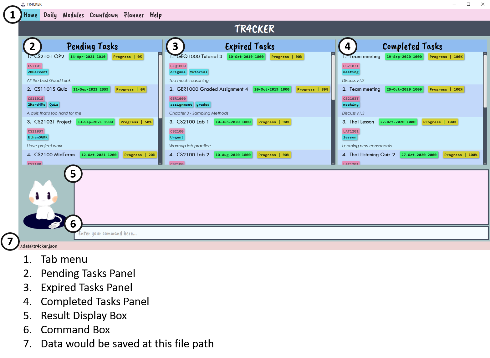
Figure 2: Labelled GUI of TR4CKER

7. Here are some example commands you can try:
* `add n/CS2103T Practical des/Catch bugs dl/today t/graded`  
    Adds a task with the description “catch bugs” and deadline of today
* `edit 1 dl/12-12-2020 1900`  
    Edits the deadline of the first task to 12th Dec 2020 1900hrs 
* `delete 1`  
    Deletes the first task in the list
* `exit`  
    Exits and closes TR4CKER

--------------------------------------------------------------------------------------------------------------------

# 3. Commands
This section guides you through the different commands of TR4CKER.

**:information_source: Notes about the command format:** 

* Words in `UPPER_CASE` are the parameters to be supplied by the user. 
  e.g. in `add n/NAME`, `NAME` is a parameter which can be used as `add n/tP week 7`.

* Items in square brackets are optional. 
  e.g `n/ NAME [t/TAG]` can be used as `n/tP week 7 t/urgent` or as `n/tP week 7`.

* Items with `…` after them can be used multiple times including zero times. 
  e.g. `[t/TAG]…` can be used as ` ` (i.e. 0 times), `t/urgent`, `t/urgent t/cs2103t` etc.

* Parameters can be in any order. 
  e.g. if the command specifies `n/NAME dl/DEADLINE`, `dl/DEADLINE n/NAME` is also acceptable.

* Command words are case-sensitive. This means that a command word of `home` is not the same as `Home` or `HOME`.

## 3.1. Common Commands
Here are some commands that you might find handy when using TR4CKER. 

### 3.1.1. Viewing help : `help`
If you cannot recall the command you need, you can enter the help command while you are in any tab.
TR4CKER will switch to the help tab, and a help window will pop out with a link to this User Guide.

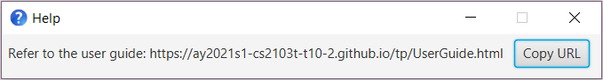

Figure 3: Expected result after running `help`

### 3.1.2. Exiting the program: `exit`

You can exit the program anytime by entering the `exit` command in any panel.

Format: `exit`

### 3.1.3. Switching between tabs

You can switch between tabs by using the following commands:

| Command    | Tab switched to |
| :----------| :--------------:|
|  `home`    | Home            |
|  `daily`   | Daily           |
|  `modules` | Modules         |
| `countdown`| Countdown       |
|  `planner` | Planner         |
|  `help`    | Help            |

Table 2: List of Switch Tab commands

## 3.2. Home (Han Wei)

TR4CKER is primarily a task management application that allows you to track and manage your tasks comprehensively.

TR4CKER's Home page was built for this purpose and you will be directed to this page once you start TR4CKER.
 
### 3.2.1 Switching to the Home tab: `home`
Suppose you are on other tabs, you can switch to the Home tab simply by using the home command. 
You can also click on the Home button on the tabs menu at the top of the screen.

Format: `home`

1. You type `home` into the command box.
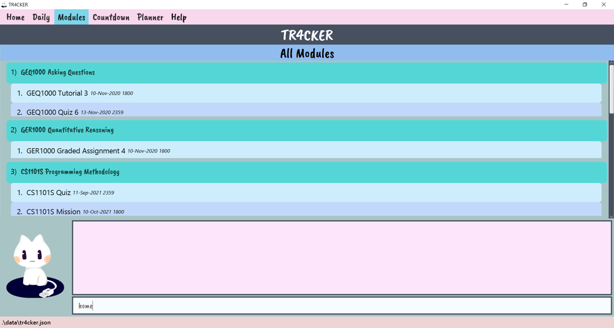
Figure 4: TR4CKER before executing `home`

2. Press enter, and TR4CKER switches to the Home tab.

Figure 5: TR4CKER after executing `home`

Example:
* `home` - Switches to Home tab, showing the task lists.

### 3.2.2. Reading the Task lists

For the ease of reading, tasks are split into 3 sections and displayed separately, namely:
1. Pending Tasks
2. Expired Tasks
3. Completed Tasks

Figure 6: Application home page populated by sample data

The Pending Tasks panel will display tasks that you have not completed but have yet to be overdue.
For tasks that are overdue but are not completed, they will be displayed under the Expired Tasks panel.
Lastly, the Completed Tasks panel will display all your completed tasks for archive purposes.

### 3.2.3. Adding new tasks: `add`

You can add a task to TR4CKER using the `add` command when you want to start working on a new task.

Format: `add n/NAME des/DESCRIPTION [m/MODULE_CODE] [dl/DEADLINE] [t/TAG]…​`

1. You type out details of your task in the command box using the `add` command.
 
    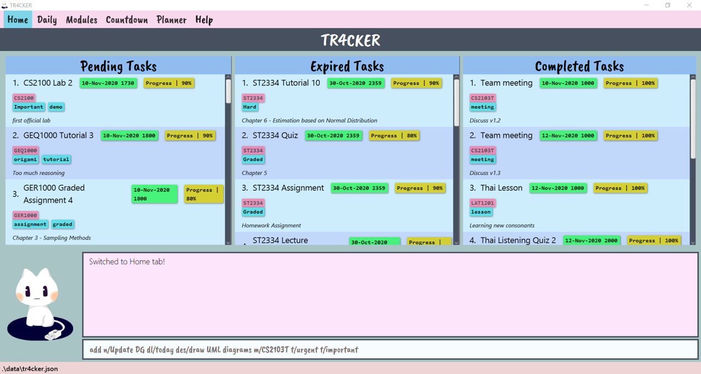
    Figure 7: TR4CKER before executing `add n/Update DG dl/today des/draw UML diagrams m/CS2103T t/urgent t/important`

2. Press <kbd>enter</kbd>, and TR4CKER will add the task.

    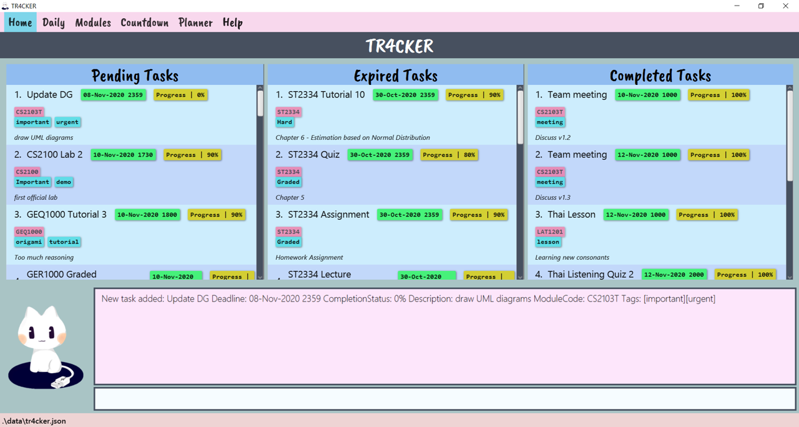
    Figure 8: TR4CKER after executing `add n/Update DG dl/today des/draw UML diagrams m/CS2103T t/urgent t/important`

You need to add the module into TR4CKER's modules list before you can link a task to that module.
To find out how to add a module in TR4CKER, you may refer to [_Section 3.4.2 - Adding a new module into the modules list_](#342-adding-a-new-module-to-modules-list).

**:information_source: Important points to note when entering Deadline:** 

1. While Deadline is an optional parameter, TR4CKER will set the Deadline to default values if you do not enter them:
    * If you do not enter a Deadline, it will be set to Today, 2359.
    * If you enter a Deadline date without specifying a time, Deadline time will be set to 2359.
2. DateTime formats accepted for Deadline:
    * dd-MM-yyyy HHmm, dd-MMM-yyy HHmm, dd-MM-yyy, dd-MMM-yyyy
        * dd: the corresponding days in 2 numbers.
        * MM: the corresponding month in 2 numbers.
        * MMM: the corresponding month in 3 letters (First letter must be capitalised, e.g. Jan, Sep).
        * yyyy: the corresponding year in 4 numbers.
        * HH: the hour the task is due, in 24-Hour format.
        * mm: the minute the task is due.
    * Natural Dates
        * Today
        * Days of week (e.g. Monday, Sunday)
            * If Monday is entered, it refers to the upcoming Monday.

:bulb: **Tip:**
Tags cannot contain spaces and must be alphanumeric!

Examples:
* `add n/tP PE m/CS2103T des/Practical Exam`
* `add n/CS1101S Quiz dl/25-11-2020 m/CS1101S des/Post-Lecture quiz`
* `add n/CS1231S Homework Assignment dl/today 2200 m/CS1231S des/Chapter 3 t/graded t/assignment`

### 3.2.4. Listing Pending tasks: `list`
Suppose you used the `find` command previously to locate some of your Pending tasks. You may use the `list` command to
go back to viewing the entire Pending Tasks list again. In addition, TR4CKER will display a list of all Pending tasks in
the Result Display box.

Format: `list`

1. You type out the `list` command into the command box.
    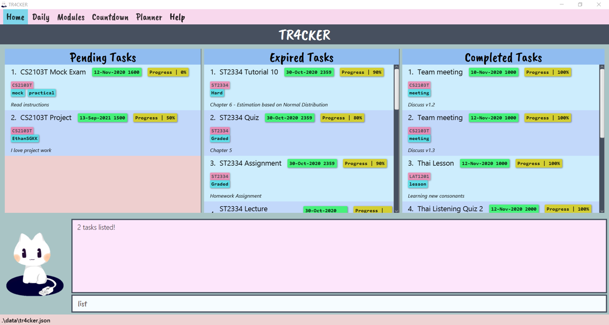
    Figure 9: TR4CKER before executing `list`

2. Press <kbd>enter</kbd>, and TR4CKER will list out all the Pending tasks.
    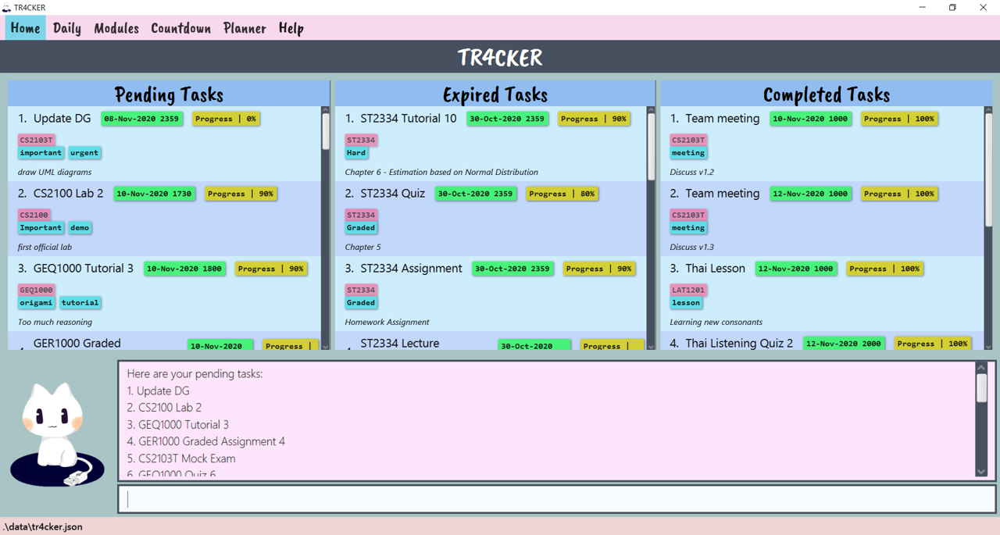
    Figure 10: TR4CKER displaying the entire Pending Tasks list after executing `list`

### 3.2.5. Marking Pending tasks as done: `done`

TR4CKER allows you to track the progress of a task in TR4CKER and you can use the `done` command when you want to update the Completion Status of a task.

Format: `done INDEX [p/COMPLETION_STATUS]`

* Updates the Completion Status of the task at the specified `INDEX`.
* The index refers to a valid index number shown in the specified Pending Tasks list.
* The index **must be a positive integer** 1, 2, 3, …​
* Completion Status is a percentage of task done and therefore only accept integer values from 0 to 100.
* If Completion Status is not entered, TR4CKER will mark the task as 100% done.

1.  You type the index number of the task and the new Completion Status into the command box using the `done` command.
    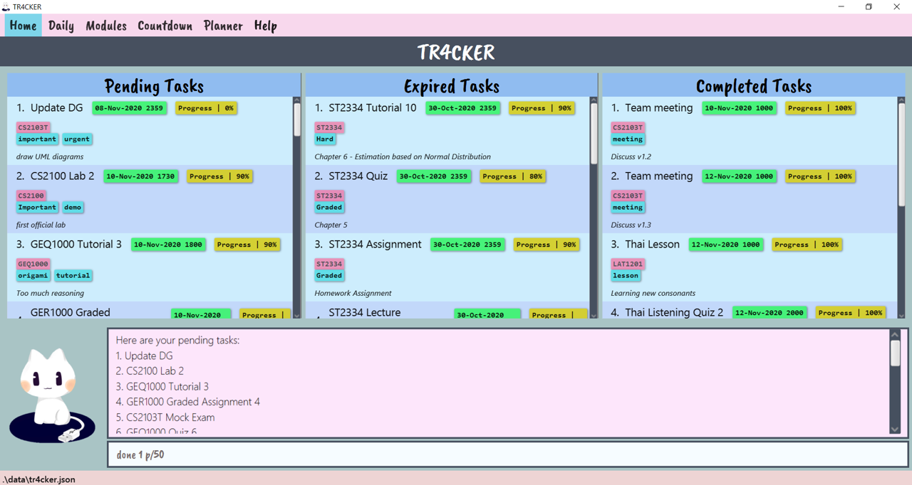
    Figure 11: TR4CKER before executing `done 1 p/50`

2.  Press <kbd>enter</kbd>, and TR4CKER will update the Completion Status of the task.
    
    Figure 12: TR4CKER after executing `done 1 p/50`

:bulb: **Tip:**
Completion Status can either be increased or decreased! However, once a task is 100% completed, it will be regarded as
completed and its Completion Status cannot be edited anymore.

Examples:
* `list` followed by `done 2 p/50` marks the 2nd task in the Pending Tasks list as 50% done.
* `find tutorial` followed by `done 1` marks the 1st task in the results of the `find` command as 100% done.

### 3.2.6. Editing Pending tasks: `edit`

Suppose you made a spelling mistake when you were adding a task in TR4CKER.
You can edit the fields of a task by using the `edit` command.

Format: `edit INDEX [n/NAME] [dl/DEADLINE] [des/DESCRIPTION] [m/MODULE_CODE]`

* Edits the task's name, deadline and description at the specified `INDEX`.
* The index refers to the index number shown in the task list.
* The index **must be a positive integer** 1, 2, 3, …​
* At least one of the optional fields must be provided.
* You need to add the module into TR4CKER's modules list before you can link a task to that module.
  To find out how to add a module in TR4CKER, you may refer to [_Section 3.4.2 - Adding a new module into the modules list_](#342-adding-a-new-module-to-modules-list).
* Editing of tags is done using `tag` command instead (Refer to the next section on [_Section 3.2.7. - Editing tags of Pending tasks_](#327-editing-tags-of-pending-tasks-tag)).

1.  You type the index number of the Pending task and its edited fields that you want to update in the command box using the `edit` command.
    
    Figure 13: TR4CKER before executing `edit 2 n/CS2100 Lab 3`

2. Press <kbd>enter</kbd>, and TR4CKER will edit the Pending task.
    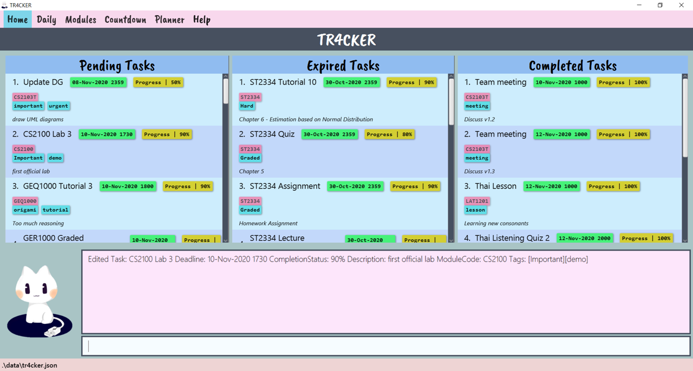
    Figure 14: TR4CKER after executing `edit 2 n/CS2100 Lab 3`

Examples:
* `edit 1 n/prepare for tP tasks` - Edits the description of the 1st task to be `prepare for tP tasks`.
* `edit 2 dl/13-Dec-2020 1930` - Edits the deadline time of the 2nd task to be 13 Dec 2020, 1930 hrs.

### 3.2.7. Editing tags of Pending tasks: `tag`

You can add or delete tags of a Pending task in TR4CKER. You may use the `tag` command to edit the tags of a task when the need arises.

Format: `tag INDEX [new/NEW_TAG]…​ [del/TAG_TO_DELETE]…​`

* Adds tag(s) to task at the specified `INDEX` when using `new/NEW_TAG`.
* Deletes tag(s) from task at the specified `INDEX` when using `del/TAG_TO_DELETE`.
* The index refers to the index number shown in the task list.
* The index **must be a positive integer** 1, 2, 3, …​
* At least one of the fields must be provided.
* Tag(s) will only be added if it does not exist yet.
* Tag(s) will only be deleted if it exists.
* Adding and deleting of tags can be used concurrently.
* Multiple tags can be added and deleted at the same time.
* Tags are case-sensitive. This means that a tag of `cs2103t` will be regarded as a different tag from `CS2103T`.

1.  You type the index number of the Pending task and its tags that you want to add or delete in the command box using the `tag` command.
    
    Figure 15: TR4CKER before executing `tag 1 del/urgent`

2.  Press <kbd>enter</kbd>, and TR4CKER will edit the tag of the Pending task.
    
    Figure 16: TR4CKER after executing `tag 1 del/urgent` with the urgent tag removed

Examples:
* `tag 1 new/urgent` - Adds a new tag `urgent` to the existing tags of 1st task (if the tag does not already exist).
* `tag 2 del/assignment` - Deletes the tag `assignment` from the 2nd task (if the tag exists).
* `tag 3 new/urgent del/assignment new/graded` - Adds 2 new tags `urgent` and `graded`, deletes the tag `assignment`
from the 3rd task.

### 3.2.8. Locating Pending tasks by keyword: `find`

When you have too many Pending tasks and you want to locate some of them, you may use the `find` command.
The `find` command allows you to find tasks which names contain any of the given keywords.

Format: `find [KEYWORD_1] [KEYWORD_2] ...`

* The search is case-insensitive. e.g `cs2103T` will match `CS21013T`.
* The order of the keywords does not matter. e.g. `Assignment CS2103T` will match `CS2103T Assignment`.
* Only the name is searched.
* Tasks matching at least one keyword will be returned (e.g. `find CS2103T Assignment` will return `CS2103T Project`,
`CS2100 Assignment 3`).

1.  You type the keywords in the command box using the `find` command.
    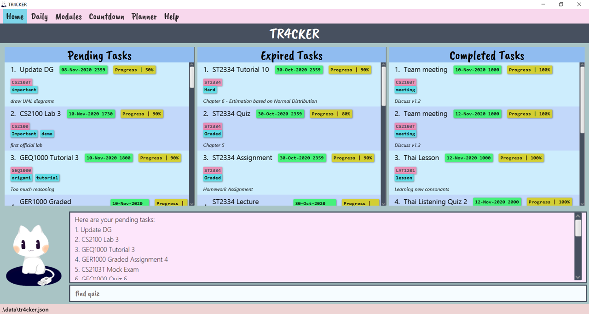
    Figure 17: TR4CKER before executing `find quiz`

2.  Press <kbd>enter</kbd>, and TR4CKER will list out all the Pending tasks that match the keywords.
    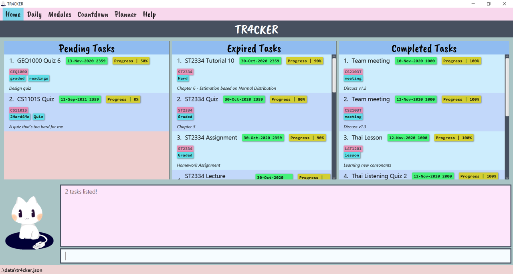
    Figure 18: TR4CKER after executing `find quiz` with the search results

Examples:
* `find CS2101` returns `CS2101 Oral Presentation 1`
* `find CS2103T Quiz` returns `CS2103T Project`, `CS1101S Quiz`

### 3.2.9. Deleting Pending tasks : `delete`

When you no longer want to keep track of a Pending task, you may delete it from TR4CKER using the `delete` command.

Format: `delete INDEX`

* Deletes the task at the specified `INDEX`.
* The index refers to a valid index number shown in the displayed task list.
* The index **must be a positive integer** 1, 2, 3, …​

1.  You type the index of the Pending task that you wish to delete in the command box using the `delete` command.
    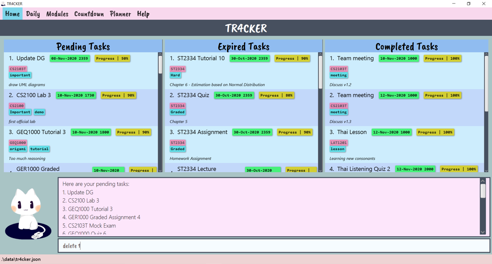
    Figure 19: TR4CKER before executing `delete 1`

2.  Press <kbd>enter</kbd>, and TR4CKER will delete the Pending task.
    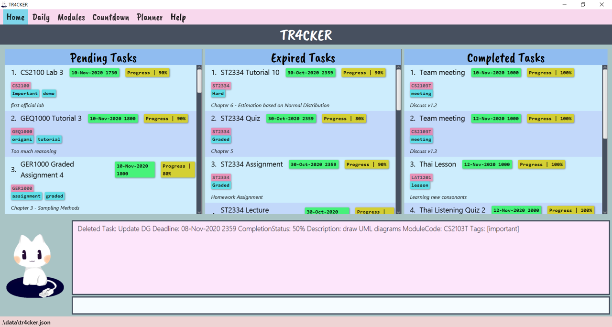
    Figure 20: TR4CKER after executing `delete 1` with the task at index 1 under the Pending Tasks panel removed from TR4CKER

Examples:
* `list` followed by `delete 2` deletes the 2nd task in the displayed task list.
* `find assignment` followed by `delete 1` deletes the 1st task in the results of the `find` command.

### 3.2.10. Editing Expired tasks: `edit expired`

The usage of this command is similar to the command explained in [_Section 3.2.6. - Editing Pending Tasks_](#326-editing-pending-tasks-edit).

Format: `edit expired INDEX [n/NAME] [dl/DEADLINE] [des/DESCRIPTION]`

**:information_source: If you edit the Deadline of an Expired Task:** 

Editing the Deadline of an Expired task will turn the task into a Pending task because new Deadline entered
must be a future Deadline. Hence, the edited task will be displayed under the Pending Task panel instead.

1.  You type the index number of the Expired task and its edited fields that you want to update in the command box using the `edit expired` command.
    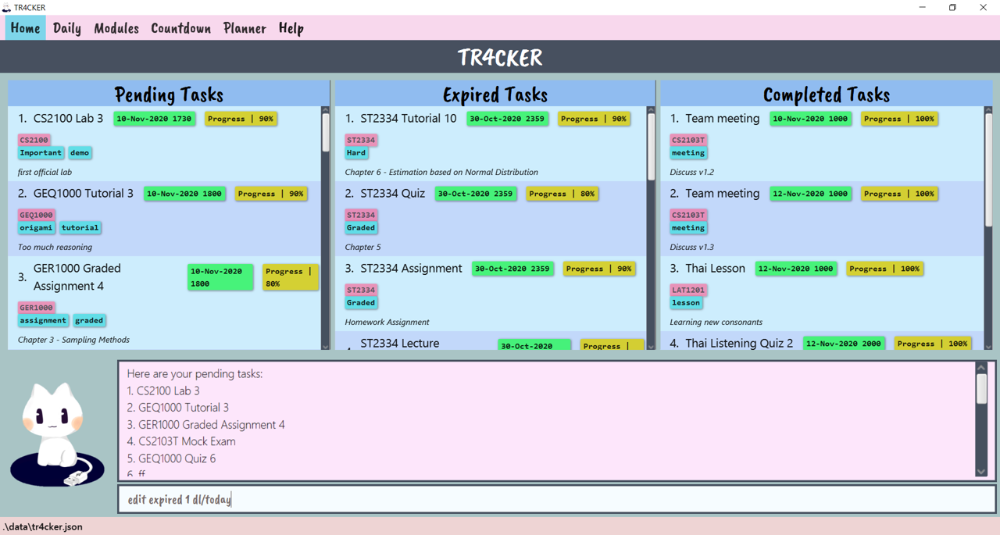
    Figure 21: TR4CKER before executing `edit expired 1 dl/today`

2.  Press <kbd>enter</kbd>, and TR4CKER will edit the Expired task with the new field.
    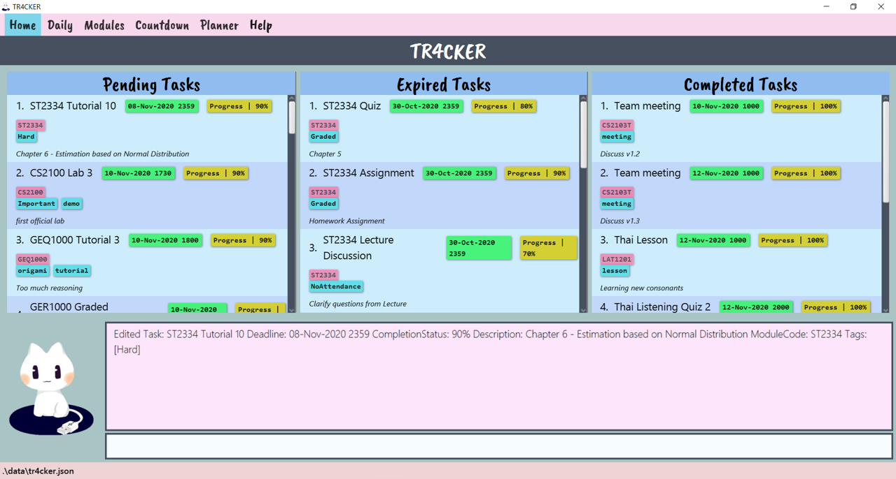
    Figure 22: TR4CKER after executing `edit expired 1 dl/today` with the edited task being displayed under Pending Tasks

### 3.2.11. Deleting Expired tasks : `delete expired`

When a task is already overdue and you do not want to work on it anymore, you may delete the expired task from TR4CKER. 
The usage of this command is similar to the command explained in [_Section 3.2.9. - Deleting Pending Tasks_](#329-deleting-pending-tasks--delete).

Format: `delete expired INDEX`

* Deletes the task at the specified `INDEX`.
* The index refers to a valid index number shown in the Expired Tasks list.
* The index **must be a positive integer** 1, 2, 3, …​

1.  You type the index of the Expired task that you wish to delete in the command box using the `delete expired` command.
    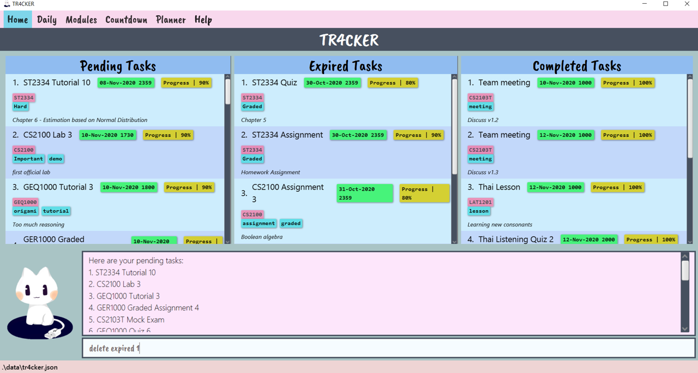
    Figure 23: TR4CKER before executing `delete expired 1`

2.  Press <kbd>enter</kbd>, and TR4CKER will delete the Pending task.
    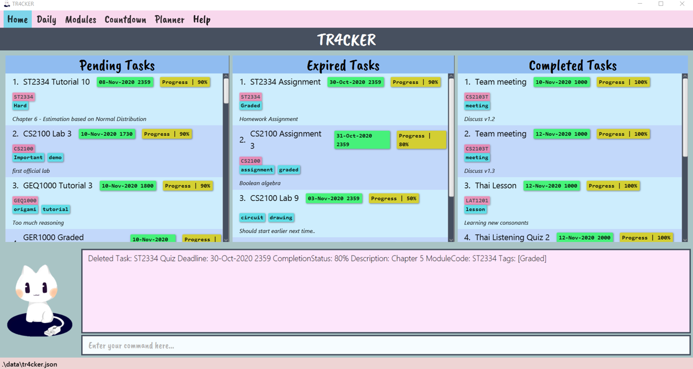
    Figure 24: TR4CKER after executing `delete expired 1` with the task at index 1 from the Expired Tasks panel removed from TR4CKER.

### 3.2.12. Resetting all data: `reset`

You may use the `reset` command to reset all data during the start of a new school semester instead of having to delete them one by one.  

Format: `reset`

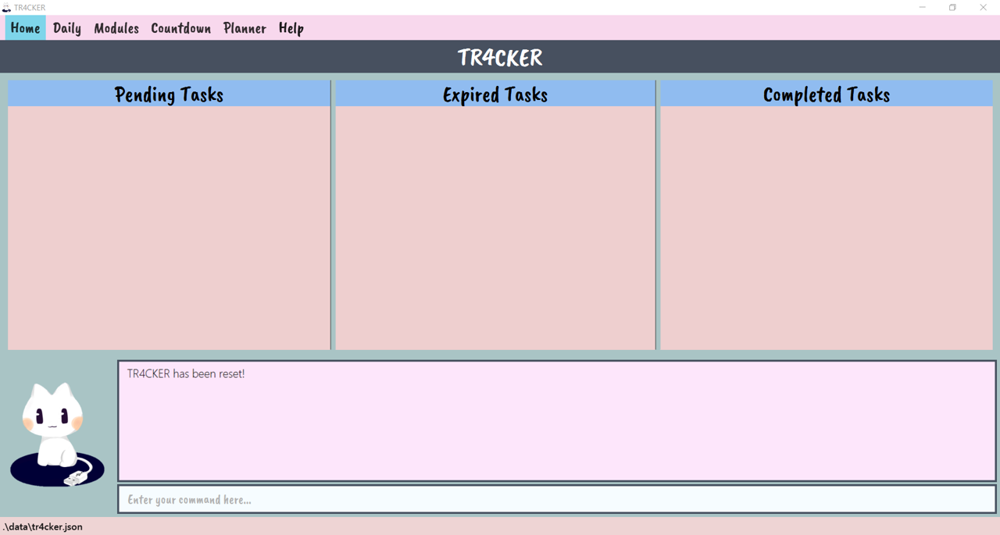
Figure 25: TR4CKER after executing `reset` with all the data purged in TR4CKER

## 3.3 Daily (Yingqi)
You can add all your daily plans of current tasks to a daily to do list so that you have a clearer idea of what you want to complete for the day.

### 3.3.1 Switching to Daily tab: `daily`
If you would like to switch to Daily tab without clicking on the Daily tab button, you can do so easily through the CLI, by just typing `daily`.

Format: `daily`

Example:
1. You type `daily` into the command box.
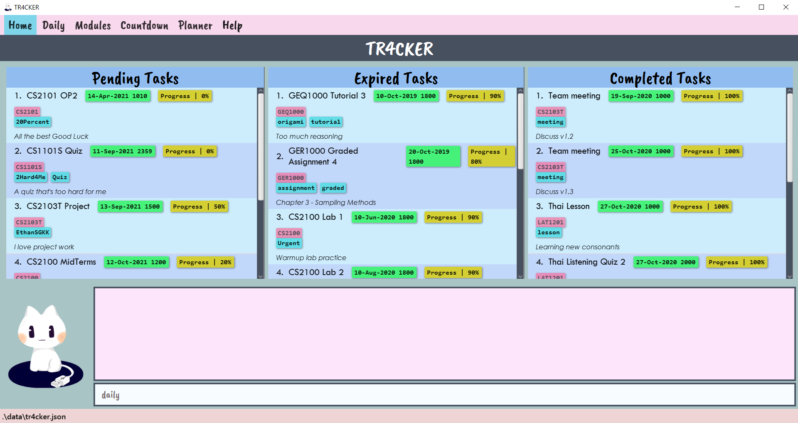
Figure 26: TR4CKER before executing `daily`

2. Press <kbd>enter</kbd> and TR4CKER should look like this:
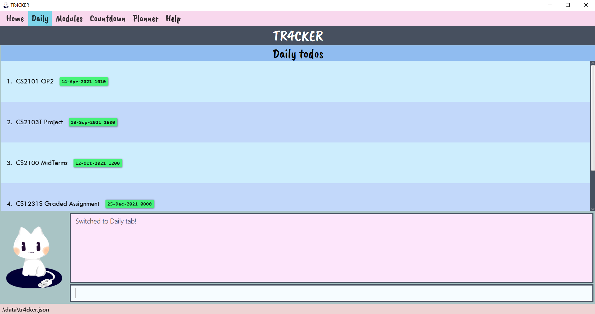
Figure 27: TR4CKER after executing `daily`

Example:
* `daily` - Switches to Daily tab.

### 3.3.2 Adding a daily todo task: `todo`
You can add a todo task for the day into the daily todo list by providing the index number of the task that you want to add.

Format: `todo INDEX`

* Adds the task at the specified `INDEX` to daily todo list.
* The index refers to a valid index number shown in the displayed task list.
* The index **must be a positive integer** 1, 2, 3, …​

1. You type `list` and press <kbd>enter</kbd> to see a list of pending tasks.
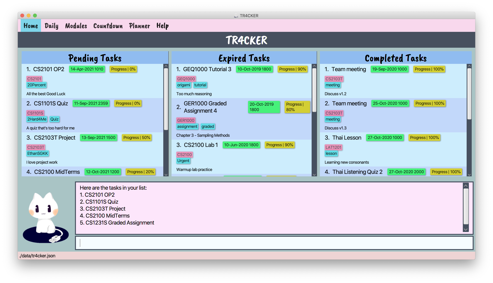
Figure 28: TR4CKER after executing `list`

2. Type `todo 1` to add the first task into daily todo list.
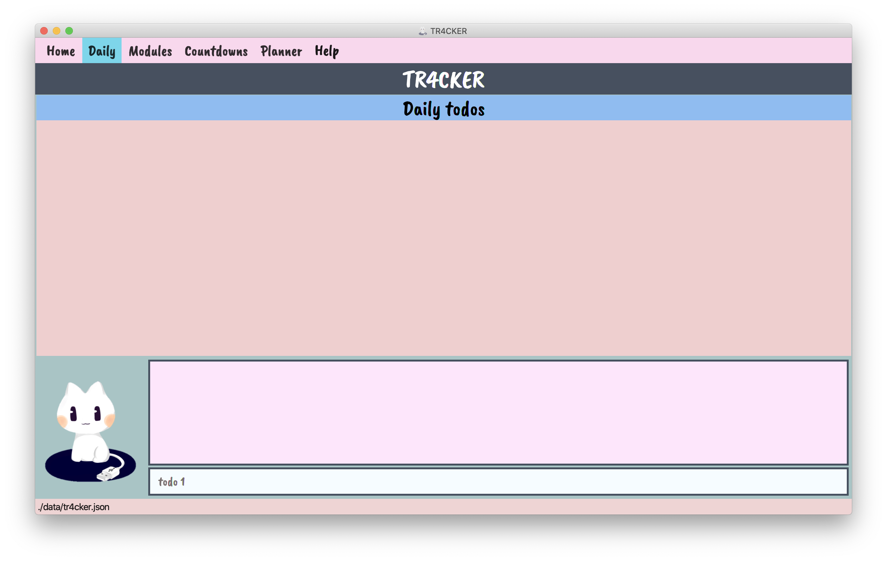
Figure 29: TR4CKER before executing `todo 1`

3. Press <kbd>enter</kbd> and the task has been added to daily todo list
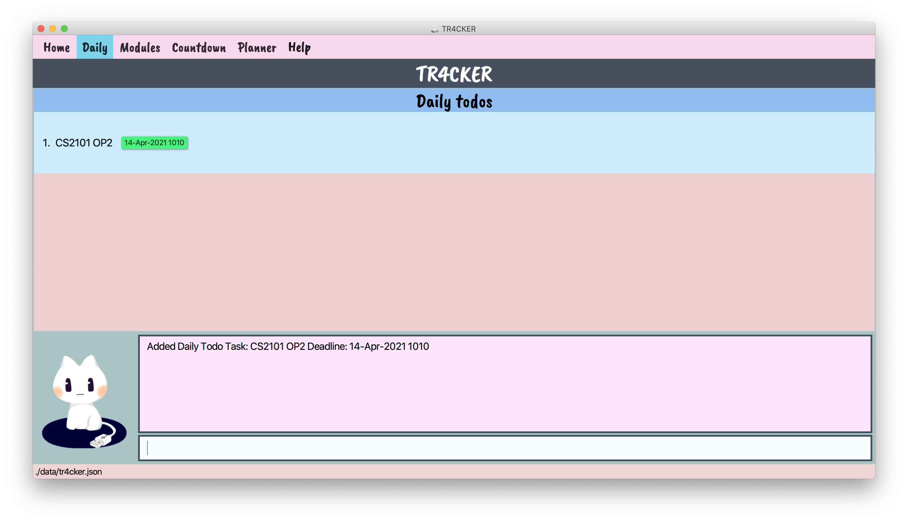
Figure 30: TR4CKER after executing `todo 1`

Examples:
* `todo 2` - Adds the 2nd Pending task into Daily task.
* `todo 3` - Adds the 3rd Pending task into Daily task.

### 3.3.3 Editing a daily todo task
You can edit details of a daily todo task using the `edit` command. 
When you edit the details of a pending task that is also in Daily todo list, the corresponding todo task will be updated as well.

1. You type `edit 1 n/CS2101 Oral Presentation 2` to edit task name of the first pending task.
    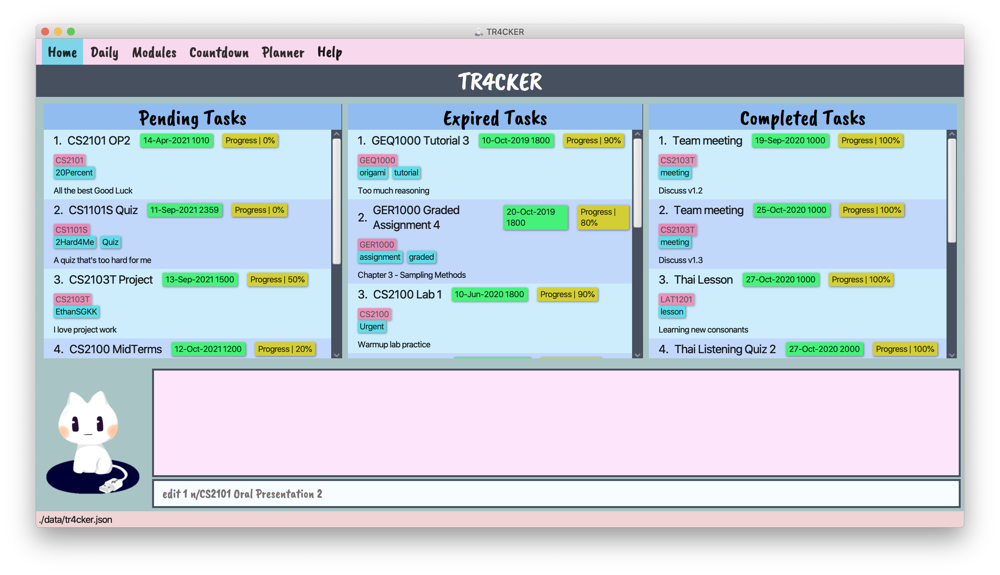
    Figure 31: Home tab before executing `edit 1 n/CS2101 Oral Presentation 2`
    
    
    Figure 32: Daily tab before executing `edit 1 n/CS2101 Oral Presentation 2`

2. Press <kbd>enter</kbd> and the name of the corresponding todo task is edited as well.
    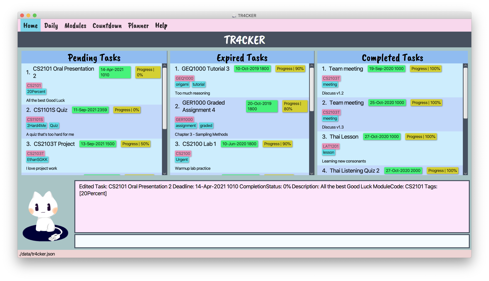
    Figure 33: Home tab after executing `edit 1 n/CS2101 Oral Presentation 2`
    
    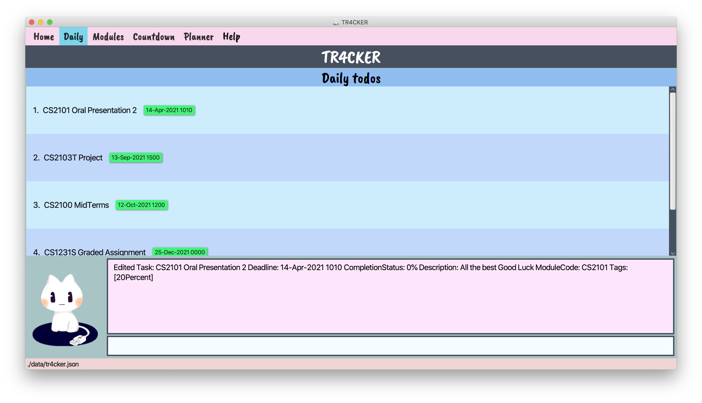
    Figure 34: Daily tab after executing `edit 1 n/CS2101 Oral Presentation 2`

Examples:
* `edit 2 n/CS2100 Assignment 4` - Edits the name of 2nd task to be `CS2100 Assignment 4`.
* `edit 3 dl/25-12-2020` - Edits the deadline of the 3rd task to be `25 Dec 2020`.

### 3.3.4 Deleting a daily todo task
You can delete a daily todo task to indicate that you have completed this todo task for the day. The corresponding task 
in pending task list will not be deleted.

Format: `daily del/INDEX`

* Deletes the todo task at the specified `INDEX` in daily todo list.
* The index refers to a valid index number shown in the daily todo list.
* The index **must be a positive integer** 1, 2, 3, …​
* If you delete a pending task using the `delete` command, the corresponding daily todo task will be removed as well.

1. You type `daily del/1` to delete the first todo task in daily todo list.
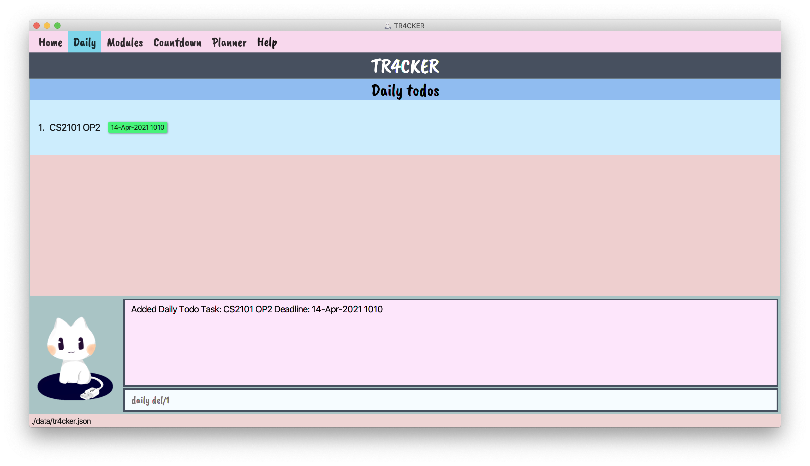
Figure 35: Daily tab before executing `daily del/1`

2. Press <kbd>enter</kbd> and the first todo task is deleted.
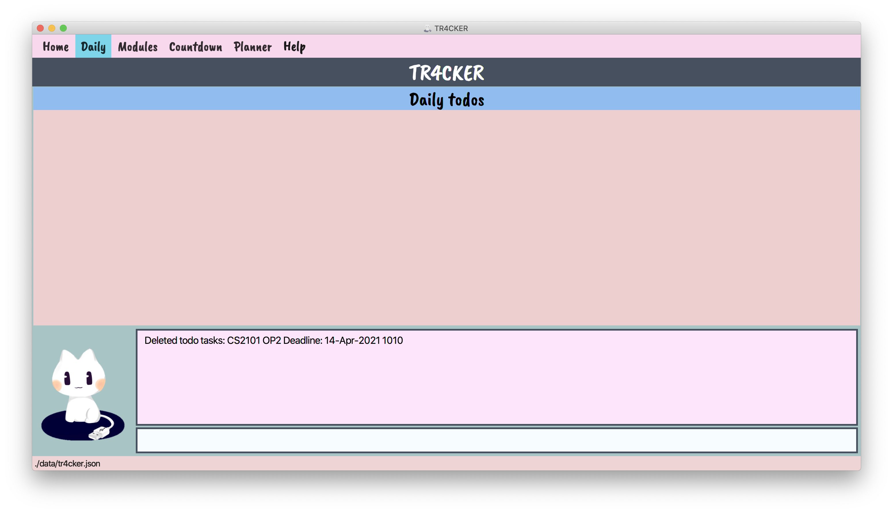
Figure 36: Daily tab after executing `daily del/1`

Examples:
* `daily del/2` - Deletes the 2nd todo task from the daily todo list.
* `daily del/10` - Deletes the 10th todo task from the daily todo list.

### 3.3.5 Expired and Completed todo tasks
The daily todo task list will update automatically when todo tasks are expired or completed.

* When a todo task is expired, it would be removed from daily todo task list instantly.
* When the completion status of a pending task is changed to 100 using the `done` command, the corresponding todo task
will be removed from daily todo task list.

## 3.4. Modules (Ethan)

You can organize your tasks according to their respective modules using the Module tab. Categorizing tasks by modules
allows you to know exactly how many tasks are still due for each of the modules you take, if you wish to work on a
particular module first.

### 3.4.1 Switching to Module tab: `modules`
To switch to the Module tab, simply type `modules` into the command line. You can also click on the Module button on the tabs
menu at the top.

Format: `modules`

1. You type `modules` into the command box.
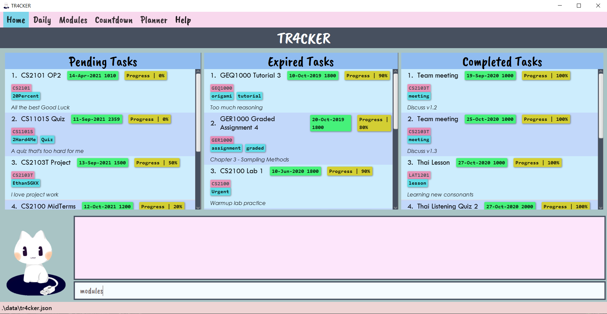
Figure 37: TR4CKER before executing `modules`

2. Press <kbd>enter</kbd> and TR4CKER should switch to the Module tab:
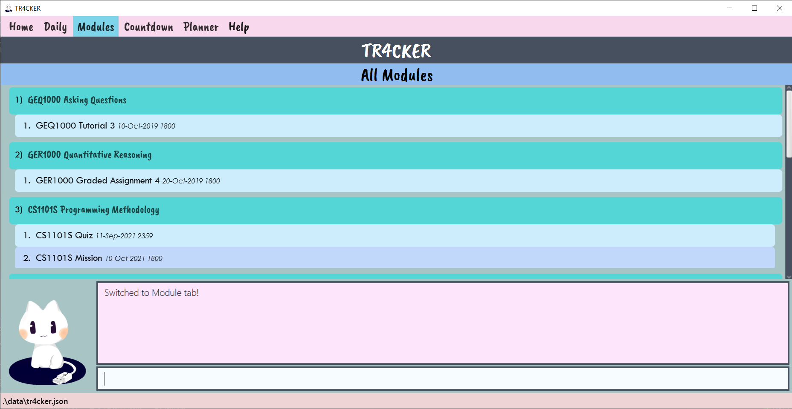
Figure 38: TR4CKER after executing `modules`

:bulb: **Note:**

The `All Modules` panel shows the list of all modules and their tasks. 
The page will be blank if no modules have been created yet.

Example:
* `modules` - Switches to Module tab, showing the list of modules.

### 3.4.2 Adding a new module to modules list:
You can add a new module to the list of modules, that TR4CKER can use to categorize tasks.

Format: `modules n/NAME m/MODULECODE`

* Adds a module with name `NAME` and module code `MODULECODE` to the modules list.
* Both fields are compulsory and can be in any order.
* `NAME` must be in the alphanumeric format (only containing letters and numbers) and preferably under
100 characters long, so that it can be displayed in the box without being truncated.
* `MODULECODE` must be in the alphanumeric format (only containing letters and numbers) and must not include any spacings.
* `MODULECODE` is case-insensitive.
* The keyword `DEL` is not a valid `MODULECODE`.

1. You type a command into the command box to create a module, let's say Computer Graphics with module code CS3241.
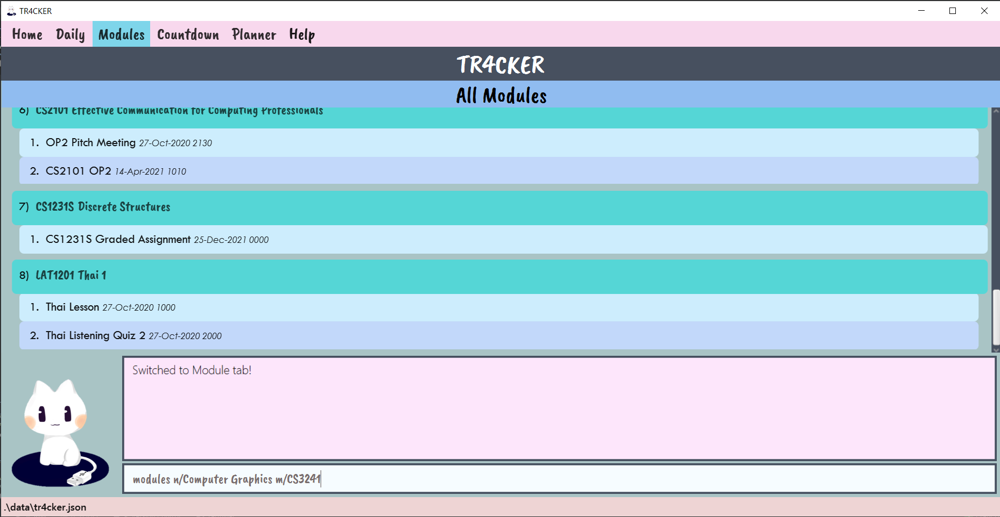
Figure 39: TR4CKER before executing `modules n/Computer Graphics m/CS3241`

2. Press <kbd>enter</kbd> and the module should appear at the bottom of the modules list:
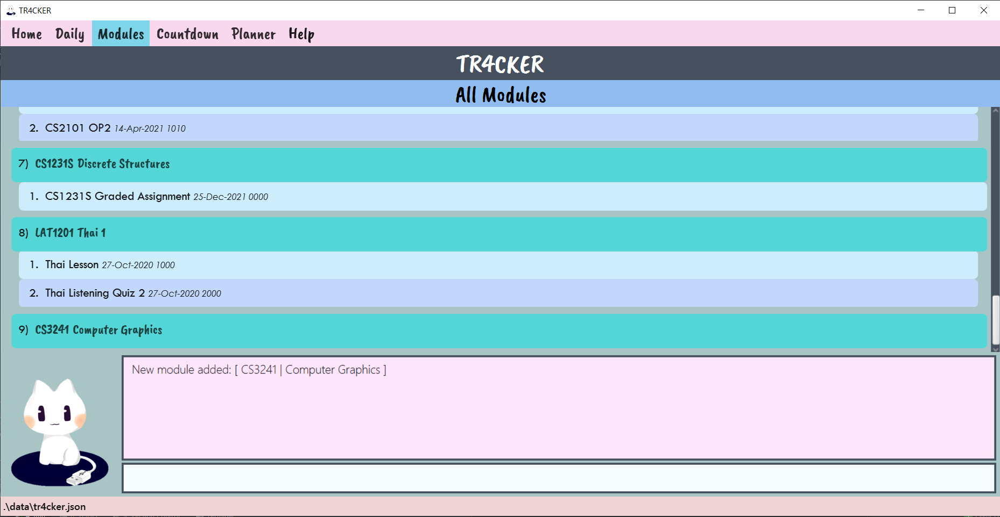
Figure 40: TR4CKER after executing `modules n/Computer Graphics m/CS3241`

Examples:
* `modules n/Computer Graphics m/CS3241` - Adds a module `Computer Graphics` with module code `CS3241`
to the modules list.
* `modules n/Effective Communication for Computing Professionals m/CS2101` - Adds a module `Effective Communication
for Computing Professionals` with module code `CS2101` to the modules list.

### 3.4.3 Assigning a task to a module
Now with modules being created in the previous section, you may want to start assigning tasks to those modules.
This will be done through the edit command in [_Section 3.2.6. - Editing Pending Tasks_](#326-editing-pending-tasks-edit).

Format: `edit INDEX [m/MODULECODE]`

* Edits the task at the specified `INDEX` to have module code `MODULECODE`.
* The index refers to a valid index number shown in the Pending Tasks list.
* The index **must be a positive integer** 1, 2, 3, …
* At least one of the optional fields must be provided.
* The module code `MODULECODE` must match one of the module codes of a module in the modules list.
* Note: Editing a task that already has a module assigned will replace it with the edited module.

**:information_source: Assigning a module code when creating a Task:** 

The optional field `[m/MODULECODE]` can be used in a similar way as other optional fields.
For example, it can be included when using the `add` command in [_section 3.2.3_](#323-adding-new-tasks-add),
to assign tasks to modules straight away.

1. You type a command into the command box to assign a module, let's say to assign task 1 to CS3241.
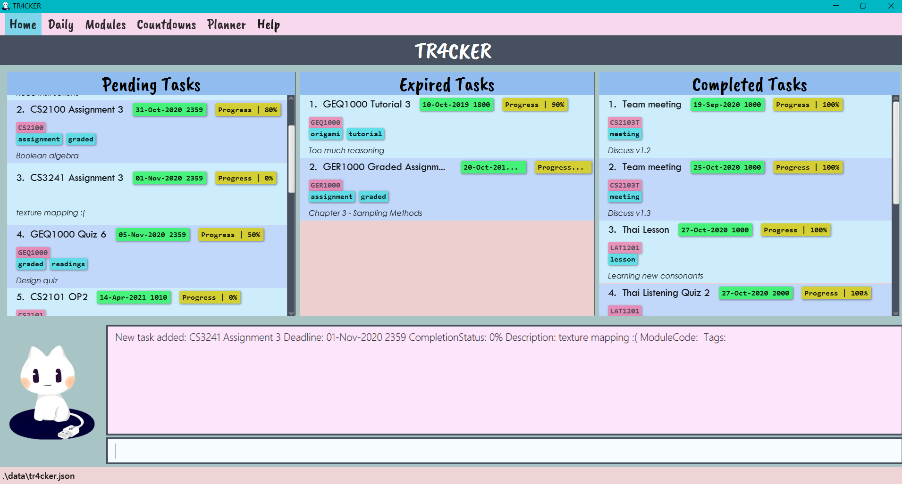
Figure 41: TR4CKER before executing `edit 1 m/CS3241`

2. Press <kbd>enter</kbd> and the module code should have been tagged with the module code.
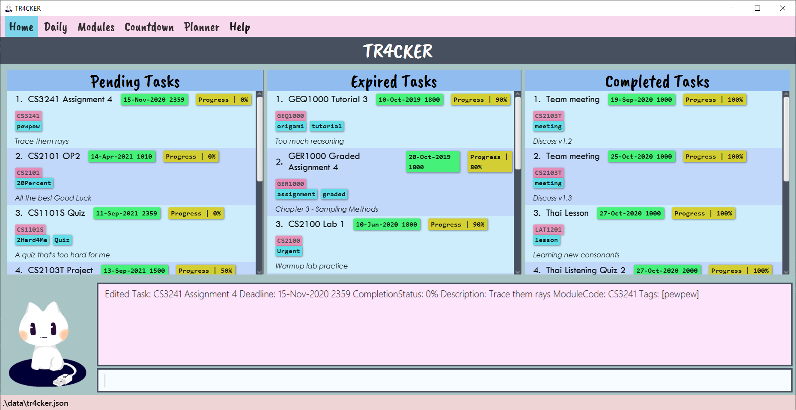
Figure 42: TR4CKER after executing `edit 1 m/CS3241`

3. Switch to the Module tab, and the task should appear under CS3241.
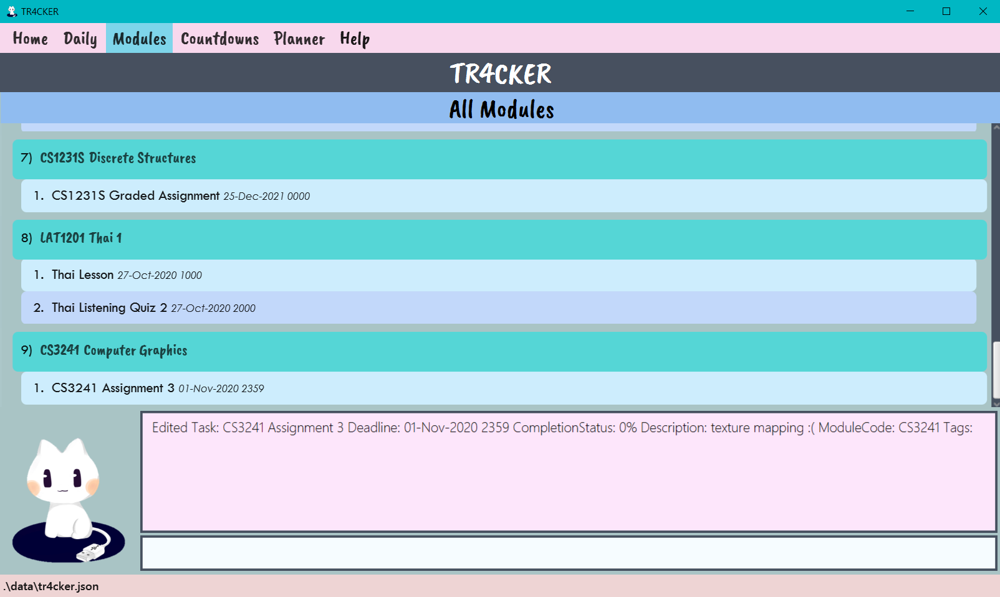
Figure 43: TR4CKER updated Module tab after executing `edit 1 m/CS3241`

As seen from *Figure 41* and *Figure 42* above, module codes tagged onto tasks will appear as a pink coloured tag under the
tasks' name.

Example:
* `edit 1 m/CS3241` - Edits the 1st task to be tagged to the module with module code `CS3241`.

### 3.4.4 Un-assigning a task from a module
Maybe you have assigned the wrong module to your task? Or maybe you just want to get rid of it. Modules can be un-assigned
from tasks in a similar way to the previous section.

Format: `edit INDEX m/del`

* Deletes module code assignment from task at the specified `INDEX`.
* The index refers to a valid index number shown in the Pending Tasks list.
* The index **must be a positive integer** 1, 2, 3, …
* Instead of providing a module code with `m/MODULECODE`, the input `m/del` signifies deleting a module code.

1. You type a command into the command box to delete a module assignment, let's say from task 1.
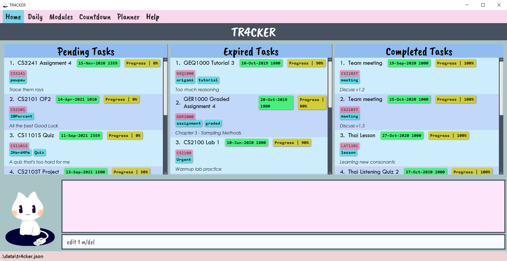
Figure 44: TR4CKER before executing `edit 1 m/del`

2. Press <kbd>enter</kbd> and the module should be unassigned from task 1.
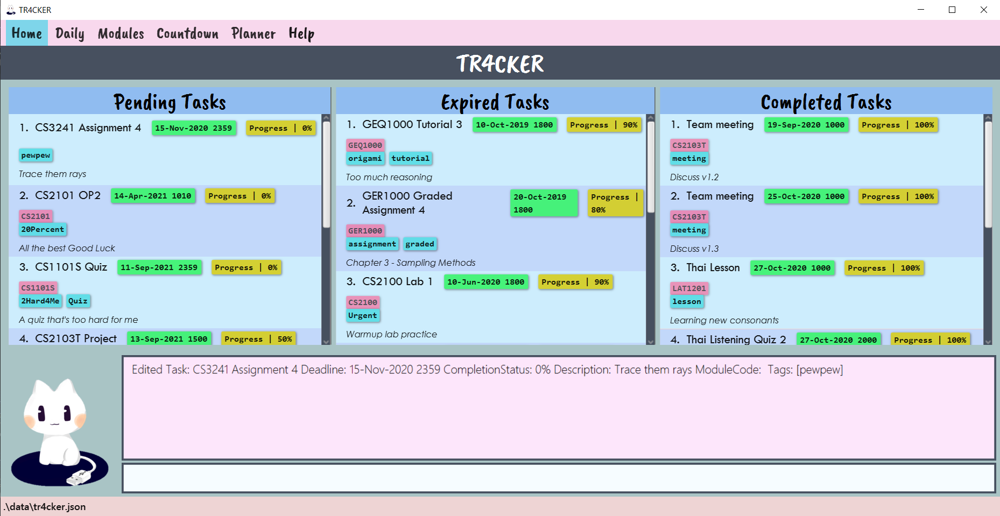
Figure 45: TR4CKER after executing `edit 1 m/del`

Example:
* `edit 3 m/del` - Deletes the module code from the 3rd task.

### 3.4.5 Deleting a module
After finishing up a semester and bringing things to a close, it's time to remove these modules as you will not be
needing them anymore. 
Make sure that no remaining tasks are still assigned to the module first before you can delete it.

Format: `modules del/INDEX`

* Deletes a module at the specified `INDEX`.
* The index refers to a valid index number shown in the module list.
* The index **must be a positive integer** 1, 2, 3, …

1. You type a command into the command box to delete a module, let's say module number 9 that we created previously.
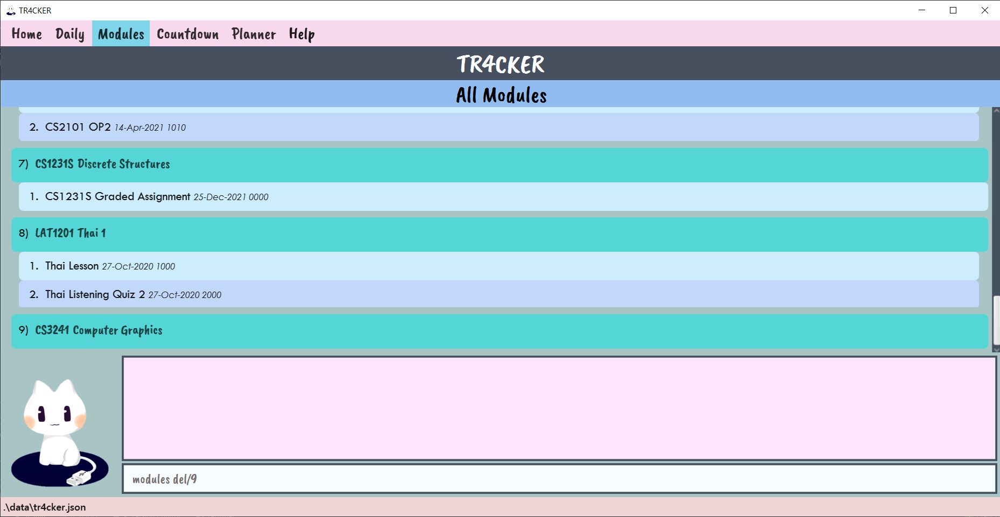
Figure 46: TR4CKER before executing `modules del/9`

2. Press <kbd>enter</kbd> and the module should be removed from the list.
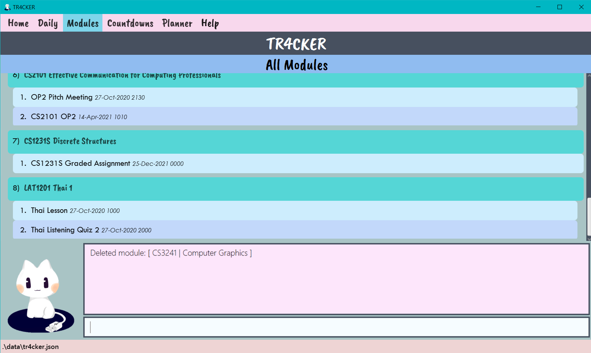
Figure 47: TR4CKER after executing `modules del/9`

:warning: Warning: This action is irreversible!

:bulb: **Note:**
TR4CKER automatically sorts your upcoming events according to the date they are due, with earlier events being shown
first. Events which occur **today** are shown right at the top, with `0 days!` shown as the number of days left, while
events which are have passed are shown at the very bottom of the list in **no particular order**. You can delete them to
stop seeing them!

Example:
* `modules del/1` - Deletes the 1st module in the modules list.

## 3.5. Countdown (Wen Ling)
You can countdown to your most essential upcoming events in the Countdown tab. The Countdown tab tells you how many days
you have left to that Final Exam or that birthday party, with just a quick glance.

### 3.5.1. Switching to Countdown tab: `countdown`
You can switch to the Countdown tab simply by using the `countdown` command. You can also click on the Countdown button
on the tabs menu at the top of the screen.

Format: `countdown`

1. You type `countdown` into the command box.
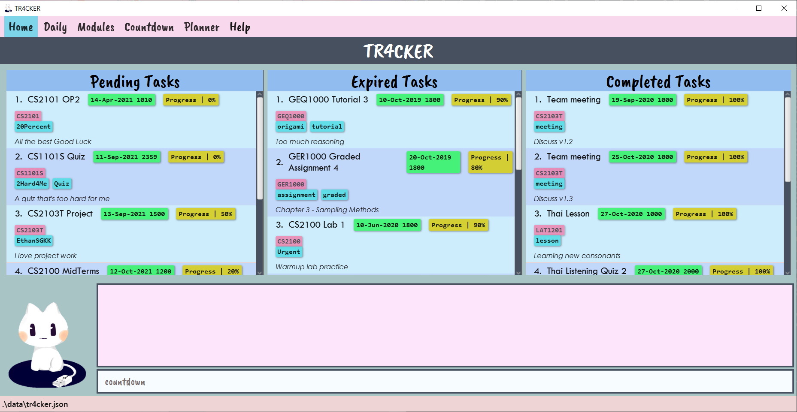
Figure 48: TR4CKER before executing `countdown`

2. Press <kbd>enter</kbd>, and TR4CKER switches to the Countdown tab.
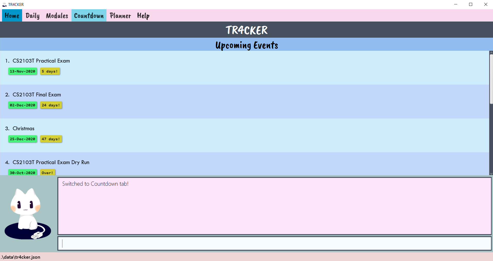
Figure 49: TR4CKER after executing `countdown`

The `Upcoming Events` panel shows your list of events in TR4CKER.

:bulb: **Note:**
TR4CKER automatically sorts your upcoming events according to the date they are due, with earlier events being shown
first. Events which occur **today** are shown right at the top, with `0 days!` shown as the number of days left, while
events which are have passed are shown at the very bottom of the list in **no particular order**. You can delete them to
stop seeing them!

Example:
* `countdown` - Switches to Countdown tab, showing the list of upcoming events.

### 3.5.2. Adding a new event to Countdown events list
You can add an event to your list of events, and TR4CKER will help you to countdown to it.

Format: `countdown n/NAME d/DATE`

* This command adds an event with name `NAME` and date `DATE` to the Countdown events list.
* Both fields are compulsory and can be in any order.
* `NAME` must be in the alphanumeric format (only containing letters and numbers).
* `DATE` must be a day in the future (i.e. NOT today or any day before today) and be in the format
`DD-MM-YYYY` or `DD-MMM-YYYY`.
* Duplicate events (events with the same `NAME`) are NOT allowed.

1. Switch to the Countdown tab to view your current list of events.

2. You type `countdown n/NAME d/DATE` into the command box, where `NAME` is the name of the event and `DATE` is the date of
the event.

Figure 50: TR4CKER before executing `countdown n/ST2334 Final Examination d/23-Nov-2020`

3. Press <kbd>enter</kbd>, and TR4CKER will add the event.
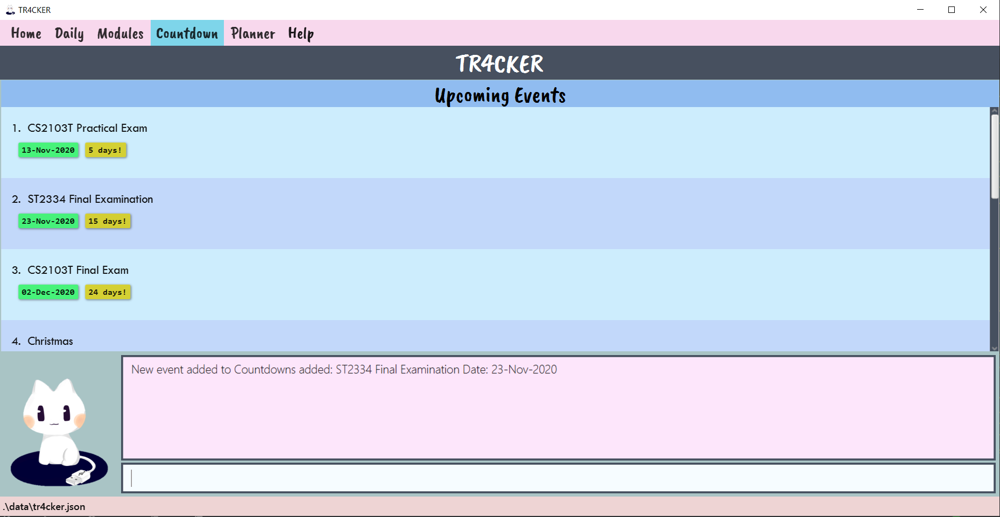
Figure 51: TR4CKER after executing `countdown n/ST2334 Final Examination d/23-Nov-2020`

Examples:
* `countdown d/31-12-2020 n/New Years Eve Countdown Party at Scarlets` - Adds the event `New Years Eve Countdown Party
at Scarlets` which occurs on `31-Dec-2020` to the Countdown events list.
* `countdown n/CS1231 Final Exam d/30-Nov-2020` - Adds an event `CS1231 Final Exam` with date `30-Nov-2020` to the
Countdown events list.

### 3.5.3. Deleting an event from countdowns list
You can delete an event from your events list when it is over, or if you no longer want to countdown to it.

Format: `countdown del/INDEX`

* This command deletes the event at index `INDEX` of the events list.
* `INDEX` has to be a valid index of an event, numbered according to the list in Countdown tab.

1. Switch to the Countdown tab to view your current list of events.

2. You type `countdown del/INDEX` into the command box, where `INDEX` is the index of the event in the events list.

Figure 52: TR4CKER before executing `countdown del/2`

3. Press <kbd>enter</kbd>, and TR4CKER will delete the event.
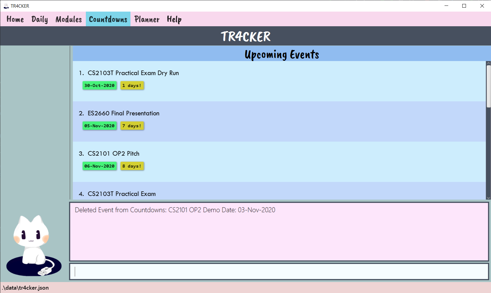
Figure 53: TR4CKER after executing `countdown del/2`

:warning: Warning: This action is irreversible!

Example:
* `countdown del/8` - Deletes the event at index `8` of the Countdowns list.

### 3.5.4 Counting the number of events in `X` days
Ever find yourself wondering how many events you have in the next `x` number of days? TR4CKER can count and give you a
summary of the events in the next `x` number of days.

Format: `countdown days/DAYS`

* This command counts and summarizes the events in the next `DAYS` number of days.
* `DAYS` has to be a non-negative integer.

1. Switch to the Countdown tab to view your current list of events.

2. You type `countdown days/DAYS` into the command box, where `DAYS` is the number of days.
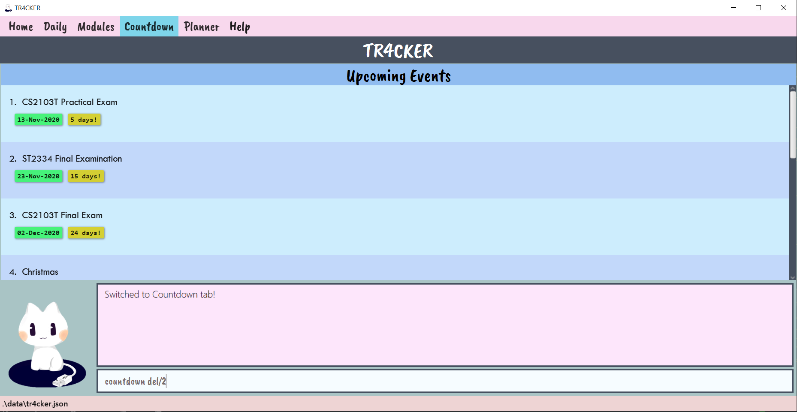
Figure 54: TR4CKER before executing `countdown days/28`

3. Press <kbd>enter</kbd>, and TR4CKER will count the events occurring in the next `DAYS` number of days.
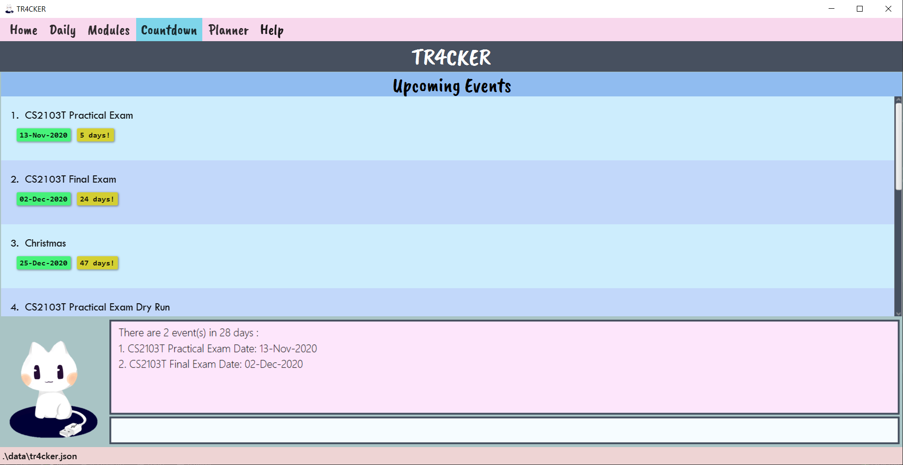
Figure 55: TR4CKER after executing `countdown days/28`

Examples:
* `countdown days/7` - Counts and summarizes the events in the next 7 days.
* `countdown days/0` - Counts and summarizes the events occurring today.
* `countdown days/90` - Counts and summarizes the events in the next 90 days.

## 3.6. Planner (Rui Ling)
You can view an overview of your schedule in a calendar view and have your tasks list side-by-side using the Planner
tab. By having an overview of your upcoming schedule, you would be able to better manage your time and hence
be more productive!

### 3.6.1. Switching to Planner tab: `planner`
If you would like to switch to Planner tab without clicking on the Planner tab button, you can do so easily through the
CLI, by just typing `planner`.

Format: `planner`

1. You type `planner` into the command box.
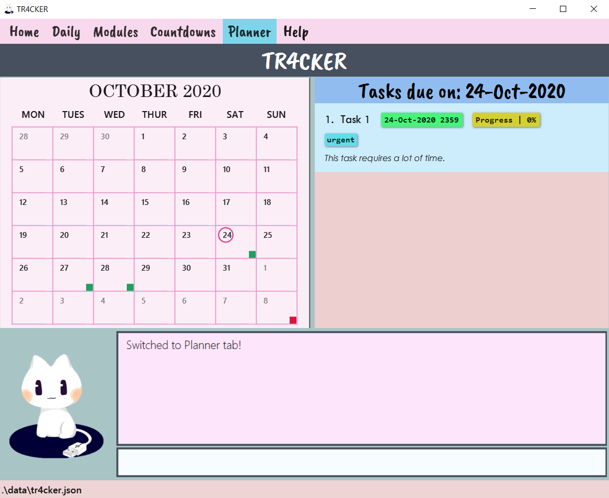
Figure 56: TR4CKER before executing `planner`

2. Press <kbd>enter</kbd> and TR4CKER should switch to Planner tab.
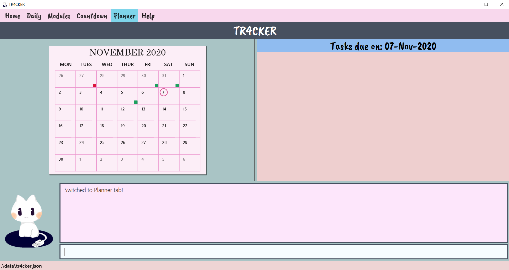
Figure 57: TR4CKER after executing `planner`

:bulb: **Note:**
By default, TR4CKER will circle today's date and the show you the tasks due on that day.
In this User Guide, today's date is taken as 7 November 2020.

Example:
* `planner` - Switches to Planner tab, showing calendar view of today and tasks due today.

### 3.6.2. Switching calendar view and tasks list
If you would like to view the calendar on specific date/month, and with the tasks due on that date beside, you can
use the different commands as explained below.

#### 3.6.2.1. Go to today or tomorrow
For the ease of accessing today's and tomorrow's tasks list, TR4CKER has provided you with 2 commands that you can use!
Short forms like "tdy" for "today" and "tmr" for "tomorrow" also allow you to save time without typing the full words.

##### 3.6.2.1.1. Today
You can view today's tasks list using this command.

Format: `planner goto/today` or `planner goto/tdy`

1. You type the command into the command box to navigate to today.
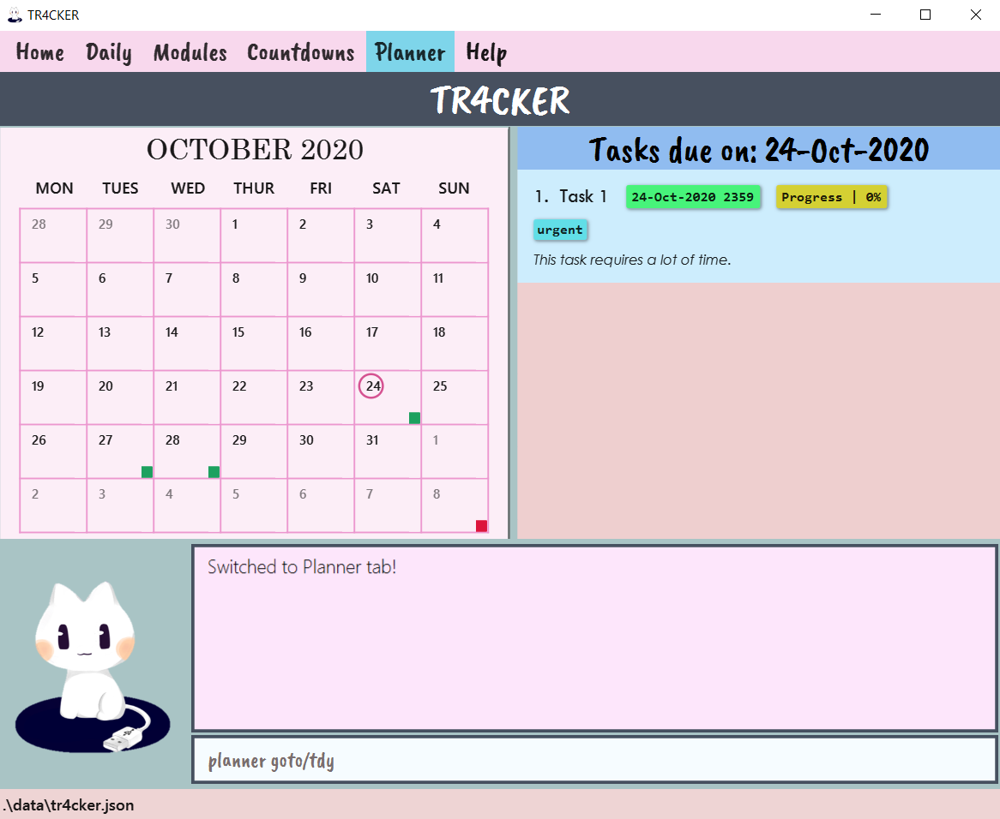
Figure 58: TR4CKER before executing `planner goto/tdy`

2. Press <kbd>enter</kbd> and TR4CKER will change planner tab to today's calendar view and tasks due today.
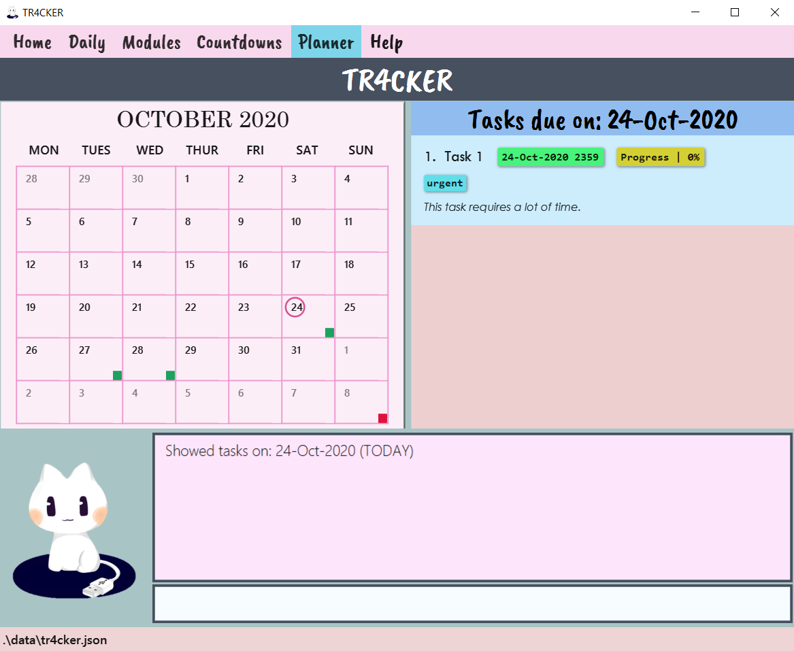
Figure 59: TR4CKER after executing `planner goto/tdy`

:bulb: **Note:**
Input can only be `today` or `tdy`. There are no other alternatives.

Examples:
* `planner goto/today`
* `planner goto/tdy` 
will both give you today's calendar view and tasks due today.

##### 3.6.2.1.2. Tomorrow
You can view tomorrow's tasks list using this command.

Format: `planner goto/tomorrow` or `planner goto/tmr`

1. You type the command into the command box to navigate to tomorrow.
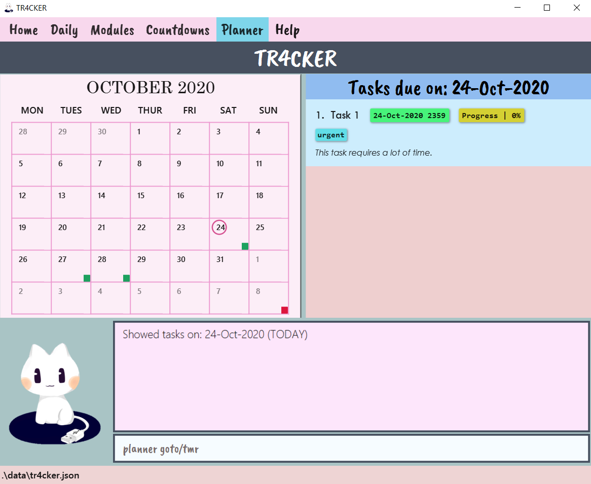
Figure 60: TR4CKER before executing `planner goto/tmr`

2. Press <kbd>enter</kbd> and TR4CKER will change planner tab to tomorrow's calendar view and tasks due tomorrow.
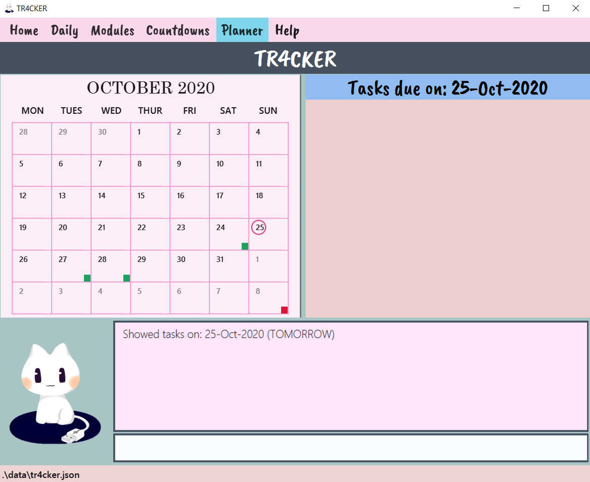
Figure 61: TR4CKER after executing `planner goto/tmr`

:bulb: **Note:**
Input can only be `tomorrow` or `tmr`. There are no other alternatives.

Examples:
* `planner goto/tomorrow`
* `planner goto/tmr` 
will both give you tomorrow's calendar view and tasks due tomorrow.

### 3.6.2.2. Go to specific date
For the ease of accessing of a specific date's tasks list, TR4CKER has provided you this command that you can use!

Format: `planner goto/DATE`

1. You type the command into the command box to navigate to a specific date, let's say 27 October 2020.
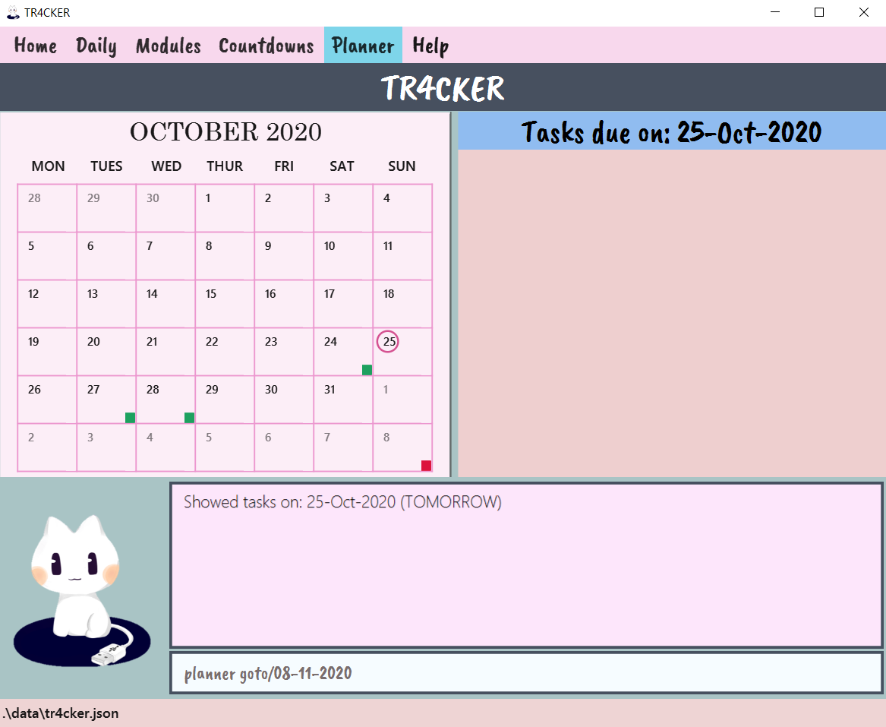
Figure 62: TR4CKER before executing `planner goto/27-10-2020`

2. Press <kbd>enter</kbd> and TR4CKER will change planner tab to the date's calendar view and tasks due on that date.
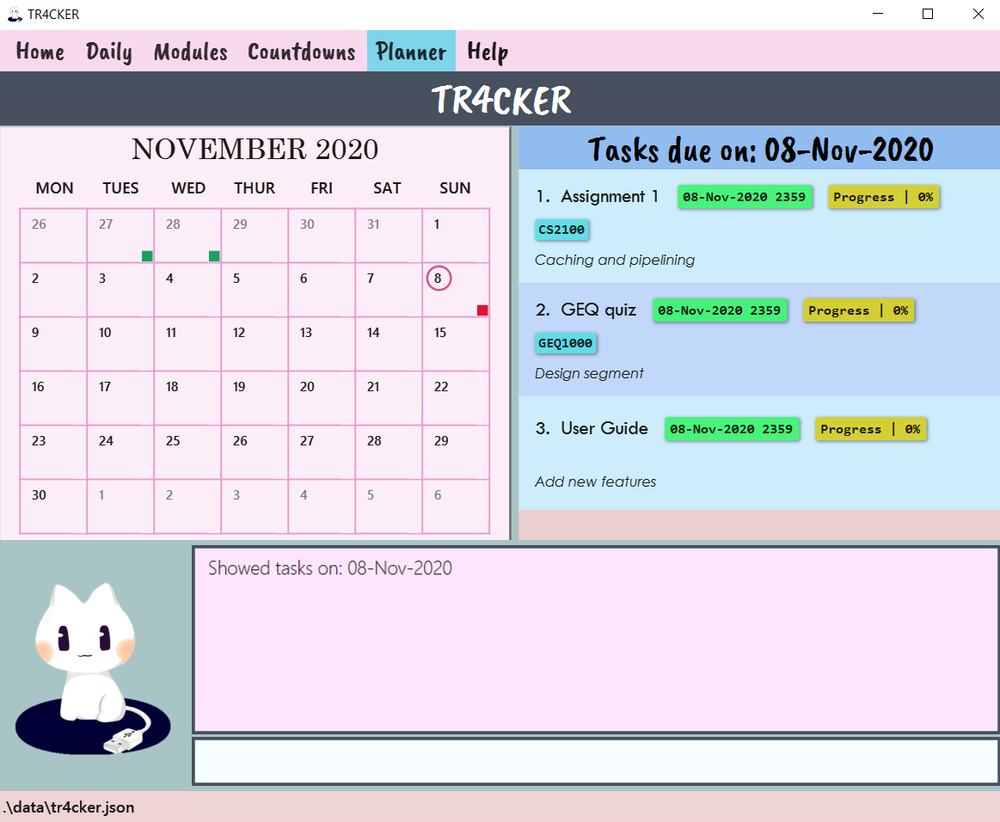
Figure 63: TR4CKER after executing `planner goto/27-10-2020`

**:information_source: Important points to note when entering the date:** 
The formats accepted for date are:
* dd-MM-yyyy and dd-MMM-yyyy
    * dd: the corresponding days in 2 numbers
    * MM: the corresponding month in 2 numbers
    * MMM: the corresponding month in 3 letters (First letter must be capitalised, e.g. Jan, Sep)
    * yyyy: the corresponding year in 4 numbers
    

Examples:
* `planner goto/02-12-2020` - Shows you the calendar view of December 2020, with 2nd December 2020 being circled, and
shows you the tasks due on 2nd December 2020.
* `planner goto/28-Feb-2021` - Shows you the calendar view of February 2021, with 28th February 2021 being circled, and
shows you the tasks due on 28th February 2021.

### 3.6.2.3. Go to specific month
For the ease of accessing of a specific month's tasks list, TR4CKER has provided you this command that you can use!

Format: `planner goto/MONTH`

1. You type the command into the command box to navigate to a specific month, let's say September 2021.

Figure 64: TR4CKER before executing `planner goto/Sep-2021`

2. Press <kbd>enter</kbd> and TR4CKER will change planner tab to the month's calendar view and tasks due on first day of the month.
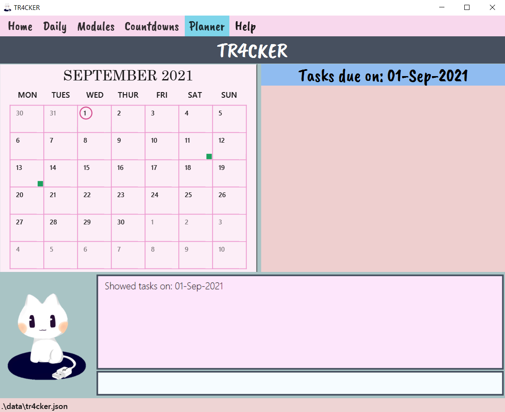
Figure 65: TR4CKER after executing `planner goto/Sep-2021`

:bulb: **Note:**
By default, TR4CKER will circle the first day of the month you inputted and show you the tasks due on the first day of
the input month.

**:information_source: Important points to note when entering the month:** 
The formats accepted for month are:
* MM-yyyy and MMM-yyyy
    * MM: the corresponding month in 2 numbers
    * MMM: the corresponding month in 3 letters (First letter must be capitalised, e.g. Jan, Sep)
    * yyyy: the corresponding year in 4 numbers
    

Examples:
* `planner goto/12-2020` - Shows you the calendar view of December 2020, with 1st December 2020 being circled, and
shows you the tasks due on 1st December 2020.
* `planner goto/Feb-2021` - Shows you the calendar view of February 2021, with 1st February 2021 being circled, and
shows you the tasks due on 1st February 2021.

### 3.6.3. Indicators on Calendar
You would have realised there are different colours tagged to every day in the calendar. To allow you to have a better
overview of your schedule, Planner tab allows you to check if your upcoming days are busy!

The figure below shows the indicators:
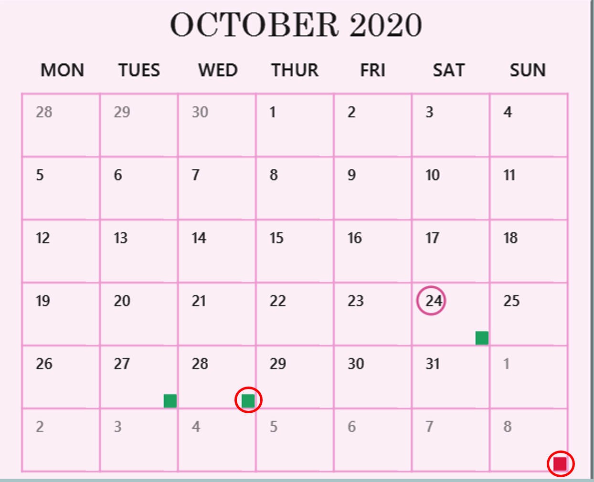
Figure 66: Indicators (circled in red) on calendar

The indicator colours and their meanings are:
* No indicator - no tasks due on that date
* Green indicator - 2 or lesser tasks due on that date
* Red indicator - more than 2 tasks due on that date

## 3.7. Saving the data

TR4CKER saves data to the hard disk automatically after any command that changes the data.
There is no need for you to save the data manually.

--------------------------------------------------------------------------------------------------------------------
# 4. Glossary

This section provides a list of definitions of some terms used in this User Guide.

* **SoC**: School of Computing, computing school in National University of Singapore (NUS).
* **GUI**: Graphical User Interface, the platform that allows users to interact with the application.
* **CLI**: Command-Line Interface, a method of interacting with computer programs by typing lines of text into a text box.
* **Task**: An item to be completed by a certain deadline, with specified task names, deadline, task description, tags (optional) and module code.
* **Todo**: An item planned to be completed in a day.
* **Event**: An item representing an event with specific event name and occurs on a specific date.
* **Module**: A subject taken by NUS students with specific module code and module name.
* **Planner**: A monthly display of tasks due on certain days in a calendar.

--------------------------------------------------------------------------------------------------------------------

# 5. FAQ

Here are some frequently asked questions that you may have.

**Q**: How do I transfer my data to another Computer? 
**A**: Install TR4CKER by downloading the `tr4cker.jar` file in the other computer and replace the default data file
it creates with the file that contains the data from your previous TR4CKER home folder.

**Q**: Is TR4CKER free? 
**A**: Yes! TR4CKER is totally free to use.

**Q**: Where can I find the latest version of TR4CKER? 
**A**: You can download the latest **tr4cker.jar** from [here](https://github.com/AY2021S1-CS2103T-T10-2/tp/releases).

**Q**: What do I do if my tasks expire? 
**A**: Don't worry, you can still edit or delete them using these commands:
[_Section 3.2.10. - Edit expired tasks_](#3210-editing-expired-tasks-edit-expired) & [_Section 3.2.11. - Delete expired tasks_](#3211-deleting-expired-tasks--delete-expired).

**Q**: Can I add multiple items at once? Multiple tasks / modules / countdowns, together in one line? 
**A**: Unfortunately, TR4CKER can only add one item at a time.

**Q**: Can I manually make changes to TR4CKER's saved file? 
**A**: This is **NOT** recommended as you could corrupt the saved file.

**Q**: Do I need an internet connection to use TR4CKER? 
**A**: Once you have downloaded TR4CKER, you can continue to use it without internet connection.

**Q**: Is TR4CKER available on my mobile device? 
**A**: TR4CKER is only available on desktop for now, but we are hoping to include mobile support in version 2.0!

--------------------------------------------------------------------------------------------------------------------

# 6. Command summary

This section provides a quick summary of the commands of TR4CKER.

| Tab | Command | Command Format | 
| --- | ------- | -------------- |
| - | Exit TR4CKER | `exit` |
| - | Help | `help` |
| - | Reset all data | `reset` |
| - | Switch to TR4CKER tab | `home` |
| - | Switch to Daily tab | `daily` |
| - | Switch to Modules tab | `modules` |
| - | Switch to Countdown tab | `countdown` |
| - | Switch to Planner tab | `planner` |
| TR4CKER | Add tasks | `add n/NAME des/DESCRIPTION [dl/DEADLINE] [m/MODULE_CODE] [t/TAG]...` |
| TR4CKER | Delete Expired tasks | `delete expired INDEX` |
| TR4CKER | Delete Pending tasks | `delete INDEX` |
| TR4CKER | Edit Expired tasks | `edit expired INDEX [n/NAME] [dl/DEADLINE] [des/DESCRIPTION]` |
| TR4CKER | Edit Pending tasks | `edit INDEX [n/NAME] [des/DESCRIPTION] [dl/DEADLINE]` |
| TR4CKER | Edit Tags of Pending tasks | `tag INDEX [old/TAG_TO_DELETE]... [new/NEW_TAG]...` |
| TR4CKER | Find Pending tasks | `find [KEYWORD]...` |
| TR4CKER | List Pending tasks | `list` |
| TR4CKER | Mark Pending tasks as done | `done INDEX [p/COMPLETION_STATUS]` |
| Daily | Add todo tasks | `todo INDEX` |
| Daily | Delete todo tasks | `daily del/INDEX` |
| Modules | Add new modules to modules list | `modules n/NAME m/MODULECODE` |
| Modules | Assign tasks to modules | `edit INDEX [m/MODULECODE]`|
| Modules | Delete modules | `modules del/INDEX` |
| Modules | Un-assign tasks from modules | `edit INDEX m/del` |
| Countdown | Add new events to countdowns list | `countdown n/NAME d/DATE` |
| Countdown | Count the events in the next `x` days | `countdown days/DAYS` |
| Countdown | Delete events from countdowns list | `countdown del/INDEX` |
| Planner | View a specific date's tasks in planner tab | `planner goto/DATE` |
| Planner | View a specific month's tasks in planner tab | `planner goto/MONTH` |
| Planner | View today's tasks in planner tab | `planner goto/today` or `planner goto/tdy` |
| Planner | View tomorrow's tasks in planner tab | `planner goto/tomorrow` or `planner goto/tmr` |
